Trend Analysis for Metals
================
Curtis C. Bohlen, Casco Bay Estuary Partnership
March 29, 2020

-   [Introduction](#introduction)
-   [Load Libraries](#load-libraries)
-   [Load Data](#load-data)
    -   [Folder References](#folder-references)
    -   [Metals Data](#metals-data)
        -   [Units](#units)
    -   [Change Factor Levels](#change-factor-levels)
        -   [Select which Metals to
            Analyze](#select-which-metals-to-analyze)
        -   [Remove Data on Metals We will Not
            Analyze](#remove-data-on-metals-we-will-not-analyze)
    -   [Estimating Non-detects](#estimating-non-detects)
        -   [Demonstrate That Worked](#demonstrate-that-worked)
-   [Utility function](#utility-function)
-   [Plot All Metals](#plot-all-metals)
-   [Linear Regression](#linear-regression)
    -   [Identify Significant
        Regressions](#identify-significant-regressions)
    -   [Significant Slopes](#significant-slopes)
    -   [Model Diagnostic Plots](#model-diagnostic-plots)
-   [Robust Regression](#robust-regression)
    -   [Identify “Significant” Regressions with Wilcoxon
        Test](#identify-significant-regressions-with-wilcoxon-test)
    -   [T-S Slopes](#t-s-slopes)
    -   [Significance Test with Kendall’s
        Tau](#significance-test-with-kendalls-tau)
    -   [Values of Tau](#values-of-tau)
        -   [Plot Tau vs. Robust Slope](#plot-tau-vs-robust-slope)
-   [ANOVA (Ordered Factor) Analysis](#anova-ordered-factor-analysis)
    -   [Era Model](#era-model)
    -   [Region Model](#region-model)
        -   [Regional Comparison Summary](#regional-comparison-summary)
    -   [Stepwise Model Selection](#stepwise-model-selection)
    -   [Extract Temporal Trends](#extract-temporal-trends)
    -   [Statistical Significance of Temporal
        Trend](#statistical-significance-of-temporal-trend)
        -   [What’s up with Lead and
            Silver](#whats-up-with-lead-and-silver)
-   [Mixed Effects Models](#mixed-effects-models)
    -   [Mixed Effects Linear
        Regression](#mixed-effects-linear-regression)
    -   [Mixed Effects ANOVA](#mixed-effects-anova)
        -   [Selected Model Terms](#selected-model-terms)
-   [Review of Temporal Trends](#review-of-temporal-trends)
    -   [Regressions](#regressions)
    -   [ANOVAs](#anovas)
-   [Selection of Final Models to
    Report](#selection-of-final-models-to-report)


# Introduction

Casco Bay Estuary Partnership collected sediment samples in 1991, 1994,
2000, 2001, 2002, 2010, and 2011 to look at concentrations of toxic
contaminants in Casco Bay surface Sediments. These studies were
complemented by data collected by under the auspices of EPA’s the
National Coastal Assessment (NCA) and National Coastal Condition
Assessment (NCCA).

Chemicals studied included metals. Here we analyze long-term trends in
metals. We use linear models only.

We do not follow the exact analyses conducted by Ramboll, as we
recalculate estimates based on maximum likelihood estimates of
non-detects. Non-detects are relatively rare, except for Selenium and
Mercury.

1.  We start with linear regression models on log-transformed data, but
    model diagnostics are not great, making assessment of statistical
    significance problematic.
2.  We examine alternative models that may address some shortcomings of
    linear models in this context, including robust (Theil-Sen)
    regressions (more correctly, median-based linear models).
3.  We explore linear mixed models, controlling for repeat samples by
    locations. We model both by year (a quantitative metric) and by
    “Era”, which is an ordered factor. These models identify more
    nominally significant trends than models that do not incorporate
    information on sampling locations.
4.  We do not explore Generalized Linear Models based on more highly
    skewed data.

Unfortunately, the results depend somewhat on the model we select. Long
term trends are clearest in the regression models. We report results in
State of Casco Bay based on the robust regression models. These are
robust alternatives to the linear regression models used by Ramboll, and
thus provide similar results to what they reported.

# Load Libraries

``` r
library(tidyverse)
#> Warning: package 'tidyverse' was built under R version 4.0.5
#> -- Attaching packages --------------------------------------- tidyverse 1.3.1 --
#> v ggplot2 3.3.5     v purrr   0.3.4
#> v tibble  3.1.6     v dplyr   1.0.7
#> v tidyr   1.1.4     v stringr 1.4.0
#> v readr   2.1.0     v forcats 0.5.1
#> Warning: package 'ggplot2' was built under R version 4.0.5
#> Warning: package 'tidyr' was built under R version 4.0.5
#> Warning: package 'dplyr' was built under R version 4.0.5
#> Warning: package 'forcats' was built under R version 4.0.5
#> -- Conflicts ------------------------------------------ tidyverse_conflicts() --
#> x dplyr::filter() masks stats::filter()
#> x dplyr::lag()    masks stats::lag()
library(readxl)
#library(knitr)

library(mblm)
library(nlme)
#> 
#> Attaching package: 'nlme'
#> The following object is masked from 'package:dplyr':
#> 
#>     collapse
#library(lme4)
library(emmeans)
#> Warning: package 'emmeans' was built under R version 4.0.5
library(MASS)
#> 
#> Attaching package: 'MASS'
#> The following object is masked from 'package:dplyr':
#> 
#>     select

library(CBEPgraphics)
load_cbep_fonts()
theme_set(theme_cbep())

library(LCensMeans)
```

# Load Data

## Folder References

``` r
sibfldnm <- 'Derived_Data'
parent   <- dirname(getwd())
sibling  <- file.path(parent,sibfldnm)
niecefldnm <- 'Data_Subsets'
niece <- file.path(sibling,niecefldnm)
fn <- "metals.csv"
```

## Metals Data

``` r
metals_data <- read_csv(file.path(niece,fn),
                      col_types = cols(.default = col_character(),
                                        Sample_Year = col_double(),
                                        Replicate = col_integer(),
                                        CASRN = col_skip(),
                                        Result = col_double(),
                                        MDL = col_double(),
                                        RL = col_double(),
                                        Det_Flag = col_integer(),
                                        Qualifier = col_skip(),
                                        `QA Qualifier` = col_skip(),
                                        Reportable_Result = col_skip(),
                                        ERL = col_double(),
                                        ERM = col_double() )
                      ) %>%
  mutate(Replicate = Replicate == -1) %>%
  mutate(Det_Flag = Det_Flag == 1) %>%
  mutate(nd_flag = ! Det_Flag) %>%
  mutate(Parameter = if_else(Parameter == "Chromium (total)",
                             "Chromium",
                             Parameter))
```

### Units

See the “Review\_Data.Rmd” for details.

Ramboll Standardized units in the Access database, so, concentrations of
metals are expressed in *μ**g*/*g* dry weight (\~ ppm).

## Change Factor Levels

``` r
metals_data <- metals_data %>%
  mutate(LVL = factor(LVL, levels = c('Below ERL','Between ERL and ERM',
                                     'Above ERM'))) %>%
  mutate(Region = factor(Region, levels = c("Inner Bay",
                                            "West Bay",
                                            "East Bay",
                                            "Outer Bay",
                                            "Cape Small"))) %>%
  mutate(Era = ordered(Era, levels = c( "1990s",  "2000s", "2010s")))
```

### Select which Metals to Analyze

``` r
(xt <- xtabs(~ Parameter + Era, data = metals_data))
#>             Era
#> Parameter    1990s 2000s 2010s
#>   Aluminum       0    83    82
#>   Antimony       0    83    82
#>   Arsenic       65    83    82
#>   Barium         0    38    75
#>   Beryllium      0    38    75
#>   Bismuth        0    38     0
#>   Cadmium       65    83    82
#>   Calcium        0    38     0
#>   Chromium      65    83    82
#>   Cobalt         0    38    75
#>   Copper        65    83    82
#>   Iron          65    83    82
#>   Lead          65    83    82
#>   Lithium        0    38     0
#>   Magnesium      0    38     0
#>   Manganese      0    83    82
#>   Mercury       65    83    82
#>   Molybdenum     0    38    75
#>   Nickel        65    83    82
#>   Potassium      0    38     0
#>   Ruthenium      0    38     0
#>   Selenium      65    83    82
#>   Silver        65    83    82
#>   Sodium         0    38     0
#>   Strontium      0    38    75
#>   Tellurium      0    38     0
#>   Thallium       0    38    75
#>   Tin            0    83    82
#>   Titanium       0     0    75
#>   Vanadium       0    38    75
#>   Zinc          65    83    82
```

### Remove Data on Metals We will Not Analyze

We restrict analysis to those metals sampled in all three Eras.

``` r
rowcount <- apply(xt,1,function(x) sum(x>0))
selected <- names(rowcount[rowcount>2])

metals_data <- metals_data %>%
  filter(Parameter %in% selected)
rm(selected)
```

## Estimating Non-detects

Using our lognormal maximum likelihood procedure. We apply this
procedure to the entire data set for each metal at one time, which may
bias results if data should not be considered as being drawn from a
single distribution (e.g., if concentrations are dramatically different
in different Regions or Eras). Because detection limits are uniformly
low, often well below most observed values, this is likely to have
relatively small effect on slope estimates, which are our focus here.

Note that conditional means associated with rare non-detects often can
not be readily estimated using the existing algorithm, because it
requires drawing a huge sample to get enough samples below the detection
limits.

We up the parameter “max\_samp” to 5 million in hopes of reducing the
number of times that happens. That slows this computation so that it
takes several minutes, but even so, we get a few observations where we
can not estimate a conditional mean. (Note that each notification,
below, is for a single observation). This behavior may be addressed in a
future version of the LCMeans package.

This is a time-consuming step, so we set cache = true. That reduces time
for reknitting the notebook, but does not help when running the notebook
interactively. An alternative would be to save a version of the data
(with estimated conditional means) after this step, and not recalculate,
but that runs the risk of leaving in outdated data if upstream data is
modified.

``` r
metals_data <- metals_data %>%
  mutate(val = if_else(nd_flag, MDL, Result)) %>%
  group_by(Parameter) %>%
  mutate(Res_ML = sub_cmeans(val, nd_flag, max_samp = 5*10^6)) %>%
  ungroup(Parameter)
#> Estimated sample size required >5e+06. Returning NA.
#> 
#> Estimated sample size required >5e+06. Returning NA.
#> 
#> Estimated sample size required >5e+06. Returning NA.
#> 
#> Estimated sample size required >5e+06. Returning NA.
#> 
#> Estimated sample size required >5e+06. Returning NA.
```

### Demonstrate That Worked

``` r
ggplot(metals_data, aes(val, Res_ML, color = nd_flag)) +
  geom_point() +
  facet_wrap('Parameter', scales = 'free') +
  theme_cbep(base_size = 10) +
  scale_y_log10() +
  scale_x_log10()
#> Warning: Removed 18 rows containing missing values (geom_point).
```

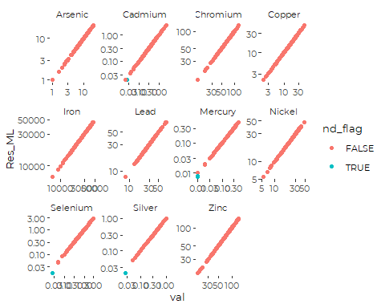

# Utility function

This is convenient for summarizing multiple models using `lapply`. Not
currently used, but handy during data exploration.

``` r
 mod_rev <- function(nm, m) {
 for (n in seq_along(m)) {
   cat("-------------------------------------\n")
   cat(nm[[n]], '\n')
   print(anova(m[[n]]))
   print(summary(m[[n]]))
   }
 }
```

# Plot All Metals

``` r
metals_data %>%
  ggplot(aes(Sample_Year, Res_ML)) +
  geom_jitter(aes(color = Det_Flag), width = 0.1, alpha = 0.3) +
  geom_smooth(method = 'lm') +
  scale_color_manual(values = cbep_colors()[2:3]) +
  facet_wrap('Parameter', scales = 'free_y') +
  scale_y_log10() +
  theme(axis.text.x = element_text(angle = 45))
#> `geom_smooth()` using formula 'y ~ x'
#> Warning: Removed 18 rows containing non-finite values (stat_smooth).
#> Warning: Removed 18 rows containing missing values (geom_point).
```

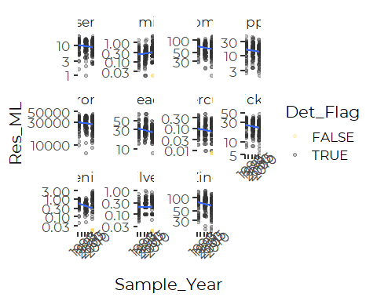

``` r
metals_data %>%
  ggplot(aes( y = Res_ML, group = Era)) +
  geom_boxplot() +
  facet_wrap('Parameter', scales = 'free_y') +
  scale_y_log10() +
  theme(axis.text.x = element_text(angle = 45))
#> Warning: Removed 18 rows containing non-finite values (stat_boxplot).
```

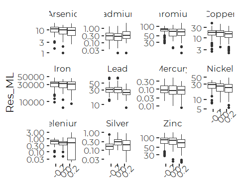
Note the wide variation….

# Linear Regression

On log-transformed data.

``` r
mods <-metals_data %>%
  group_by(Parameter) %>%
  nest() %>%
  mutate(lr_mod = lapply(data,
                      function(df) lm(log(Res_ML) ~ Sample_Year, data = df)))
```

## Identify Significant Regressions

From the log-linear models. We use P &lt; 0.025 because of relatively
poor model diagnostics. We don’t want to trust “borderline” P values,
and we don’t want to go to the trouble (for this purpose) of using
bootstraps or other methods to assess confidence limits more rigorously.

``` r
lm_p_vals <- lapply(mods$lr_mod ,function(m) summary(m)$coefficients[2,4])
names(lm_p_vals) <- mods$Parameter
```

So, statistically significant regressions include the following

``` r
sig_lms <- names(lm_p_vals[lm_p_vals<0.025])
sig_lms
#> [1] "Chromium" "Lead"     "Nickel"   "Selenium" "Zinc"
```

(Note that Cadmium and Silver show POSITIVE trends if you run this
analysis on the raw `Result`. That analysis is in error, as a
“non-detect” IS data, just not fully quantified data. In essence, using
`Result` drops all NDs from the analysis, which tends to bias results by
omitting values that we know are low, simply because we don’t know HOW
low they are.

## Significant Slopes

Lets look at the Parameters of significant regressions.

``` r
lm_slopes <- lapply(mods$lr_mod ,function(m) coefficients(m)[[2]])
names(lm_slopes) <- mods$Parameter
lm_slopes[lm_p_vals<0.025]
#> $Chromium
#> [1] -0.008083342
#> 
#> $Lead
#> [1] -0.01061815
#> 
#> $Nickel
#> [1] -0.008230204
#> 
#> $Selenium
#> [1] -0.03178244
#> 
#> $Zinc
#> [1] -0.008647957
```

All metals with significant trends are decreasing. Ramboll wrote about
Selenium, pointing to what they saw as a POSITIVE slope, but their
analysis omitted non-detects. But because of the strong non-normal
distribution of the selenium data, and because the selenium data from
2010 and 2011 had a very different distribution from earlier
observations, we don’t believe either analysi..

## Model Diagnostic Plots

``` r
oldpar <- par()
par(mfrow = c(2,2))
paste(as.character(mods$Parameter[lm_p_vals<0.05]), collapse = '   ...   ')
#> [1] "Chromium   ...   Lead   ...   Nickel   ...   Selenium   ...   Zinc"
lapply(mods$lr_mod[lm_p_vals<0.05],plot)
```

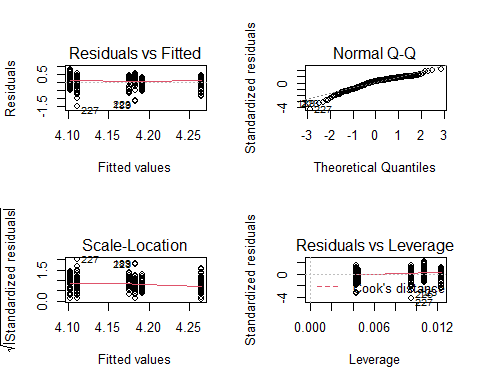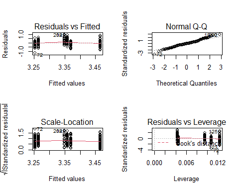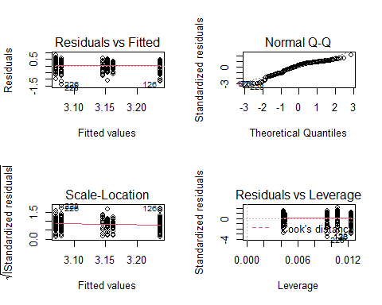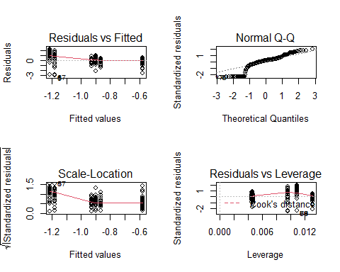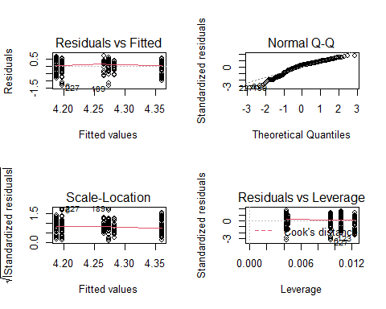

    #> [[1]]
    #> NULL
    #> 
    #> [[2]]
    #> NULL
    #> 
    #> [[3]]
    #> NULL
    #> 
    #> [[4]]
    #> NULL
    #> 
    #> [[5]]
    #> NULL
    par(oldpar)
    #> Warning in par(oldpar): graphical parameter "cin" cannot be set
    #> Warning in par(oldpar): graphical parameter "cra" cannot be set
    #> Warning in par(oldpar): graphical parameter "csi" cannot be set
    #> Warning in par(oldpar): graphical parameter "cxy" cannot be set
    #> Warning in par(oldpar): graphical parameter "din" cannot be set
    #> Warning in par(oldpar): graphical parameter "page" cannot be set

The model diagnostic plots are not great for most of these models, but
not dreadful, except for Selenium, where the large number of NDs is a
serious problem. The biggest problem is that the data (even after
transformation) is not normally distributed, generally with heavy tails.
We should not take reported p values too seriously.

# Robust Regression

We can conduct a robust regression, based on Theil-Sen (actually Seigal)
slope estimators, or (nearly equivalently) Kendall’s Tau.

We could not get the following to work inside a pipe or `lapply()` call,
so we fell back on using a loop. Also, `mblm()` does not like having a
log transform in the model formula, so we had to move the log transform
outside the call.

``` r
lmods <- list()
for (n in seq_along(mods$lr_mod)) {
  metal <- mods$Parameter[n]
  tmp <- metals_data %>%
    filter(Parameter == metal) %>%
    mutate(logval = log(Res_ML)) %>%
    filter(! is.na(Res_ML))
  rlm <- mblm(logval ~ Sample_Year, data = tmp)
  lmods[[metal]] <- rlm
}

mods$rlm <- lmods
rm(lmods, rlm, tmp, metal)
```

The structure of the summaries and coefficients are similar to `lm()`,
so we can use similar code to extract the details we want. Statistical
significance here is based on wilcox.test, which may not be entirely
appropriate. An alternative test can be based on Kendal’s Tau follows.

## Identify “Significant” Regressions with Wilcoxon Test

We choose not to rely on the significance test produced by the
`summary.mblm()` function. It is based on `wilcox.test()`, which is a
rank test procedure, thus ignoring magnitudes entirely. It has been
criticized in the literature, and is even subtly put down in the
`summary.mblm()` documentation.

In our setting, `wilcox.test()` identifies many more significant
patterns than do traditional linear models. However many of the
estimates slopes are quite low (data not shown).

A better conceptual match for testing the significance of the TS slope
estimates is Kendall’s Tau, which is appropriate in this setting, with
only a single predictor.

## T-S Slopes

``` r
rlm_slopes <- unlist(lapply(mods$rlm ,function(m) coefficients(m)[[2]]))
names(rlm_slopes) <- mods$Parameter
```

## Significance Test with Kendall’s Tau

We use p &lt; 0.05, since the a Theil-Sen analysis is less affected by
underlying distributions.

``` r
mods <- mods %>%
  mutate(tau_test = 
           lapply(data,
                  function(df) cor.test(~ log(Res_ML) + Sample_Year,
                                        data = df,
                                        method = 'kendall')))
```

## Values of Tau

Tau functions (here) like a robust alternative to a correlation
coefficient. Negative values imply declining metals concentrations, just
as negative slopes would.

``` r
tau =   unlist(lapply(mods$tau_test, function(t) t$estimate))
names(tau) <- mods$Parameter
```

``` r
tau_p_vals = lapply(mods$tau_test, function(t) t$p.value)
names(tau_p_vals) <- mods$Parameter

(sig_tau <- names(tau_p_vals[tau_p_vals<0.05]))
#> [1] "Cadmium"  "Chromium" "Lead"     "Nickel"   "Zinc"
```

### Plot Tau vs. Robust Slope

``` r
tibble(tau = tau, slope = rlm_slopes) %>%

  ggplot(aes(tau, slope)) + geom_point(aes(color = tau_p_vals < 0.05)) +
  geom_hline(yintercept = 0, color = 'gray') +
  geom_vline(xintercept = 0, color = 'gray') +
  geom_text(aes(label = mods$Parameter), hjust = 0,
            nudge_x = .005, nudge_y = -0.0005) +
  scale_x_continuous(expand = c(0.2, 0)) +
  theme_cbep(base_size = 10)
```


So, we now end up with Cadmium increasing, Chromium, Lead, and Nickel
and Zinc declining. Mercury is the only metal that shows different
direction of change under the two tests, and Selenium has small tau, but
large slope. None of the metals with significant changes are
inconsistent.

Selenium shows no trend, although it showed a decline under linear
regression. This analysis is preferable, since Selenium had many missing
values. But even here, because of ties or near ties, we should not take
p values too seriously.

Similarities between results under linear regression and robust
regression give some confidence that model results are not strongly
influenced by model choice.

Still, a more careful analysis might:  
1. Test alternate GLMs that handle heavily skewed data, or  
2. Use permutation tests to generate confidence intervals and “p values”

Since our main purpose is development of graphics and table, these steps
are not strictly necessary here.

# ANOVA (Ordered Factor) Analysis

## Era Model

We can implement a similar model, fitting Eras instead of Sample\_Years,
by fitting an ordered factor. The default coding for an ordered factor
splits the fit into linear and quadratic terms, which here is
appropriate. One should be aware, however, that the coding with only
three levels of an ordered factor contrasts the first and third levels,
effectively ignoring the intermediate one. Whether you consider that a
feature or a bug, will depend on your perspective. Under a similar
linear model, deviations from linear trend become part of the error
term. Here, it is fit as part of the quadratic term.

Our focus is on saying whether there are long term trends, so we are
principally interested in the linear term.

``` r
mods <- mods %>%
  mutate(era_anova = lapply(data,
                      function(df) lm(log(Res_ML) ~ Era, data = df)))
```

Again, because of the non-normal distribution of error, we rely on p
&lt; 0.025 as “poor man’s check” on potential problems with estimating p
values.

``` r
era_p_vals <- lapply(mods$era_anova ,function(m) summary(m)$coefficients[2,4])
names(era_p_vals) <- mods$Parameter

sig_era <- names(era_p_vals[era_p_vals<0.025])

era_slopes <- lapply(mods$era_anova ,function(m) coefficients(m)[[2]])
names(era_slopes) <- mods$Parameter
era_slopes[sig_era]
#> $Chromium
#> [1] -0.1176704
#> 
#> $Lead
#> [1] -0.1463322
#> 
#> $Nickel
#> [1] -0.1137825
#> 
#> $Selenium
#> [1] -0.4561798
#> 
#> $Zinc
#> [1] -0.1199401
```

That list should look familiar. It’s the same list as we found with a
normal linear regression.

## Region Model

We compare results from standard ANOVA, which assumes uniform variances,
and Welch’s ANOVA, which does not.

``` r
mods <- mods %>%
  mutate(region_anova = lapply(data,
                      function(df) lm(log(Res_ML) ~ Region, data = df)),
         region_welch = lapply(data,
                      function(df) oneway.test(log(Res_ML) ~ Region, data = df)))
```

For the ANOVA we pull the p value from the ANOVA table, rather than the
summary, because we want to an overall test for inequality across all
regions. ’summary.lm()`provides an array, but`anova.lm()\` produces a
data frame, with non-syntactic variable names.

We start by examining just one metal, here Arsenic, to confirm that we
can extract the value we want.

``` r
(a <- anova(mods$region_anova[[1]]))
#> Analysis of Variance Table
#> 
#> Response: log(Res_ML)
#>            Df Sum Sq Mean Sq F value   Pr(>F)   
#> Region      4  4.147 1.03665  4.2687 0.002384 **
#> Residuals 225 54.641 0.24285                    
#> ---
#> Signif. codes:  0 '***' 0.001 '**' 0.01 '*' 0.05 '.' 0.1 ' ' 1
cat('--------------------------------\n')
#> --------------------------------
names(a)
#> [1] "Df"      "Sum Sq"  "Mean Sq" "F value" "Pr(>F)"
a$`Pr(>F)`[1]
#> [1] 0.002383963
```

``` r
(b <- mods$region_welch[[1]])
#> 
#>  One-way analysis of means (not assuming equal variances)
#> 
#> data:  log(Res_ML) and Region
#> F = 4.1691, num df = 4.000, denom df = 88.903, p-value = 0.003849
cat('--------------------------------\n')
#> --------------------------------
names(b)
#> [1] "statistic" "parameter" "p.value"   "method"    "data.name"
```

We use code similar to what we used above to extract p values for all
models. We get the same metals showing significant patterns regardless
of which test we use, which increases confidence in the general results.

``` r
region_p_vals = lapply(mods$region_anova, function(t) anova(t)$`Pr(>F)`[1])
names(region_p_vals) <- mods$Parameter

(sig_region <- names(region_p_vals[region_p_vals<0.025]))
#>  [1] "Arsenic"  "Cadmium"  "Chromium" "Copper"   "Iron"     "Lead"    
#>  [7] "Nickel"   "Zinc"     "Mercury"  "Silver"

welch_p_vals = lapply(mods$region_welch , function(t) t$p.value)
names(welch_p_vals) <- mods$Parameter

names(region_p_vals[welch_p_vals<0.025])
#>  [1] "Arsenic"  "Cadmium"  "Chromium" "Copper"   "Iron"     "Lead"    
#>  [7] "Nickel"   "Zinc"     "Mercury"  "Silver"
```

So almost all metals show differences by region, by both tests. We want
to apply a *post-hoc* test to each metal with significant regional
differences to highlight differences among regions. We use the
`pairs.emmGrid()` function to do so. By default, this uses Tukey’s test.

``` r
for (n in seq_along(mods$Parameter)) {
  metal <- mods$Parameter[n]
  #cat('\n--------------------', metal, '--------------------\n')
  emm <- emmeans(mods$region_anova[[n]], ~ Region, type = 'Response')
  #print(pairs(emm) )
  print(pwpp(emm, type = "response") + ggtitle(metal))
}
```

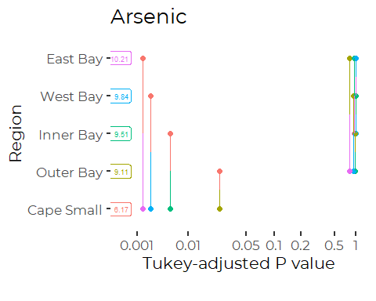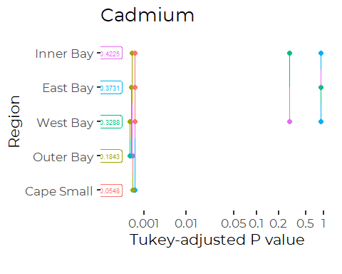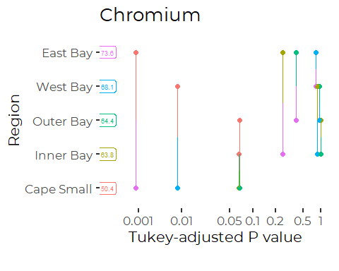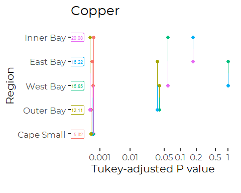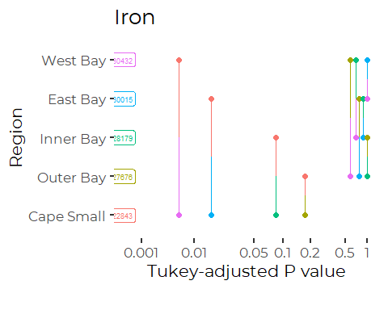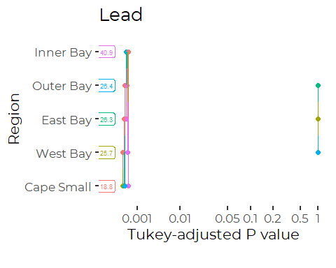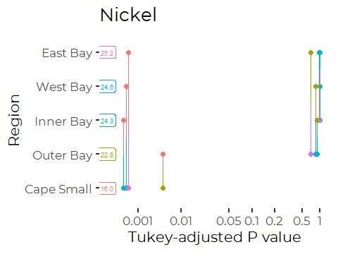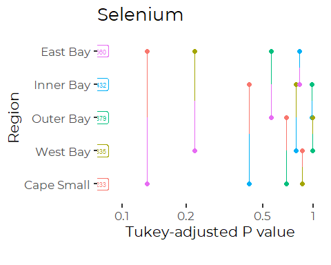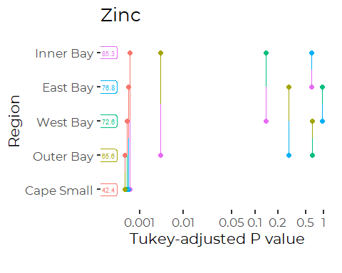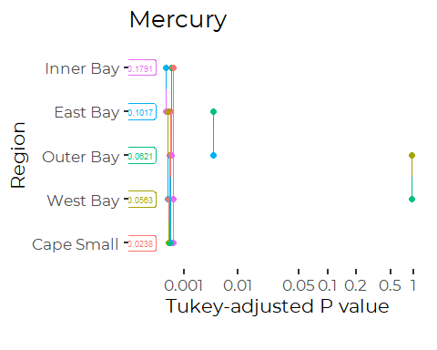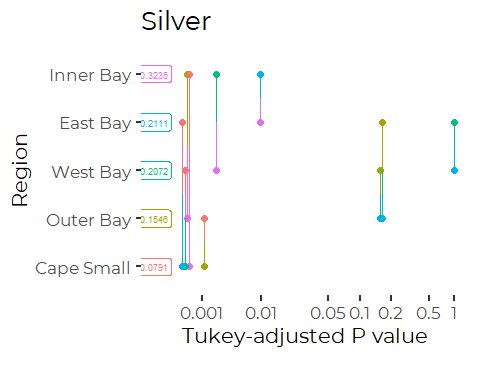

### Regional Comparison Summary

| Metal    | Comparison of Regions                                               |
|----------|---------------------------------------------------------------------|
| Arsenic  | Cape Small is low.                                                  |
| Cadmium  | Outer Bay is low; Cape Small is even lower.                         |
| Chromium | Cape Small is lower than East Bay and West Bay.                     |
| Copper   | Outer Bay is low; Cape Small even lower.                            |
| Iron     | Cape Small is lower than East Bay and West Bay.                     |
| Lead     | Cape Small is Low; Inner Bay is high.                               |
| Mercury  | Cape Small &lt; Outer Bay and West Bay &lt; East Bay &lt; Inner Bay |
| Nickel   | Cape Small is Low.                                                  |
| Silver   | Cape Small is Low; Inner Bay is high.                               |
| Zinc     | Cape Small is Low. Outer Bay lower than inner Bay.                  |

## Stepwise Model Selection

We use stepwise model selection by AIC, using the `step()` function.

We could not get the following to work inside a pipe or `lapply()` call,
so we fell back on using a loop.

``` r
lmods <- list()
for (n in seq_along(mods$region_anova)) {
  metal <- mods$Parameter[n]
  tmp <- metals_data %>%
    filter(Parameter == metal)
  mod <- lm(log(Res_ML) ~ Era * Region, data = tmp)
  mod2 <- step(mod, trace = FALSE, direction = 'both')
  lmods[[metal]] <- mod2
}
mods$step_anova <- lmods
rm(lmods, tmp, mod, mod2)
```

Here are the final, selected models. Era (both linear and quadratic
terms ) are selected in most of the models.

``` r
lapply(mods$step_anova, function(x) x$call)
#> $Arsenic
#> lm(formula = log(Res_ML) ~ Region, data = tmp)
#> 
#> $Cadmium
#> lm(formula = log(Res_ML) ~ Era + Region, data = tmp)
#> 
#> $Chromium
#> lm(formula = log(Res_ML) ~ Era + Region, data = tmp)
#> 
#> $Copper
#> lm(formula = log(Res_ML) ~ Era + Region, data = tmp)
#> 
#> $Iron
#> lm(formula = log(Res_ML) ~ Region, data = tmp)
#> 
#> $Lead
#> lm(formula = log(Res_ML) ~ Era * Region, data = tmp)
#> 
#> $Nickel
#> lm(formula = log(Res_ML) ~ Era + Region, data = tmp)
#> 
#> $Selenium
#> lm(formula = log(Res_ML) ~ Era, data = tmp)
#> 
#> $Zinc
#> lm(formula = log(Res_ML) ~ Era + Region, data = tmp)
#> 
#> $Mercury
#> lm(formula = log(Res_ML) ~ Era + Region, data = tmp)
#> 
#> $Silver
#> lm(formula = log(Res_ML) ~ Era * Region, data = tmp)
```

``` r
mods$Parameter
#>  [1] "Arsenic"  "Cadmium"  "Chromium" "Copper"   "Iron"     "Lead"    
#>  [7] "Nickel"   "Selenium" "Zinc"     "Mercury"  "Silver"
```

We want to look at the second row of the coefficient table for those
models that included an “Era” term.

``` r
(a <- lapply(mods$step_anova,
               function(m) 'Era' %in% attr(terms(m), 'term.labels')))
#> $Arsenic
#> [1] FALSE
#> 
#> $Cadmium
#> [1] TRUE
#> 
#> $Chromium
#> [1] TRUE
#> 
#> $Copper
#> [1] TRUE
#> 
#> $Iron
#> [1] FALSE
#> 
#> $Lead
#> [1] TRUE
#> 
#> $Nickel
#> [1] TRUE
#> 
#> $Selenium
#> [1] TRUE
#> 
#> $Zinc
#> [1] TRUE
#> 
#> $Mercury
#> [1] TRUE
#> 
#> $Silver
#> [1] TRUE
```

``` r
sig_list <- mods$Parameter[as_vector(a)]
sig_list
#> [1] "Cadmium"  "Chromium" "Copper"   "Lead"     "Nickel"   "Selenium" "Zinc"    
#> [8] "Mercury"  "Silver"
```

## Extract Temporal Trends

``` r
for (p in sig_list) {
  row <- mods[mods$Parameter == p,]
  m <-  row$step_anova[[1]]
  cat(p,'\n')
  print(summary(m)$coefficients[2,c(1,4)])
}
#> Cadmium 
#>   Estimate   Pr(>|t|) 
#> 0.09551498 0.23542361 
#> Chromium 
#>     Estimate     Pr(>|t|) 
#> -0.124698652  0.002509458 
#> Copper 
#>     Estimate     Pr(>|t|) 
#> -0.150251181  0.007474739 
#> Lead 
#>     Estimate     Pr(>|t|) 
#> -0.194263881  0.000447006 
#> Nickel 
#>     Estimate     Pr(>|t|) 
#> -0.124344987  0.005018625 
#> Selenium 
#>     Estimate     Pr(>|t|) 
#> -0.456179774  0.001618013 
#> Zinc 
#>     Estimate     Pr(>|t|) 
#> -0.136078236  0.001799012 
#> Mercury 
#>    Estimate    Pr(>|t|) 
#> -0.19567575  0.01134726 
#> Silver 
#>    Estimate    Pr(>|t|) 
#> -0.04531393  0.74348597
```

Note that cadmium and silver are included here, because the Era term was
retained in the best model by stepwise methods, but the linear term is
not significant.

All metals with significant trends were declining.

## Statistical Significance of Temporal Trend

This only tests the significance of the linear main effect, not
interactions or the quadratic term for Era. The only models fit with an
important interaction were for lead and silver, so we handle them as
special cases in a moment.

``` r
step_p_vals <- lapply(mods$step_anova ,function(m) summary(m)$coefficients[2,4])
names(step_p_vals) <- mods$Parameter

sig_step <- names(step_p_vals[step_p_vals<0.025])
sig_step
#> [1] "Chromium" "Copper"   "Lead"     "Nickel"   "Selenium" "Zinc"     "Mercury"
```

### What’s up with Lead and Silver

Note that Lead is the only that selects a model with a significant
interaction.

``` r
pb_dat <- metals_data %>%
  filter(Parameter == 'Lead')
pb_mod <- lm(formula = log(Res_ML) ~ Era * Region, data = pb_dat)
summary(pb_mod)
#> 
#> Call:
#> lm(formula = log(Res_ML) ~ Era * Region, data = pb_dat)
#> 
#> Residuals:
#>      Min       1Q   Median       3Q      Max 
#> -0.97870 -0.13228  0.01734  0.15539  0.55676 
#> 
#> Coefficients:
#>                        Estimate Std. Error t value Pr(>|t|)    
#> (Intercept)             3.71218    0.03023 122.780  < 2e-16 ***
#> Era.L                  -0.19426    0.05448  -3.566 0.000447 ***
#> Era.Q                  -0.19806    0.05017  -3.948 0.000107 ***
#> RegionWest Bay         -0.46418    0.04335 -10.708  < 2e-16 ***
#> RegionEast Bay         -0.43848    0.04704  -9.322  < 2e-16 ***
#> RegionOuter Bay        -0.41788    0.04611  -9.062  < 2e-16 ***
#> RegionCape Small       -0.77369    0.05974 -12.951  < 2e-16 ***
#> Era.L:RegionWest Bay    0.09771    0.07785   1.255 0.210809    
#> Era.Q:RegionWest Bay    0.10684    0.07221   1.480 0.140454    
#> Era.L:RegionEast Bay    0.09269    0.08353   1.110 0.268393    
#> Era.Q:RegionEast Bay    0.07791    0.07935   0.982 0.327322    
#> Era.L:RegionOuter Bay  -0.11162    0.08037  -1.389 0.166319    
#> Era.Q:RegionOuter Bay   0.11858    0.07937   1.494 0.136631    
#> Era.L:RegionCape Small  0.19815    0.10713   1.850 0.065746 .  
#> Era.Q:RegionCape Small  0.27226    0.09968   2.731 0.006829 ** 
#> ---
#> Signif. codes:  0 '***' 0.001 '**' 0.01 '*' 0.05 '.' 0.1 ' ' 1
#> 
#> Residual standard error: 0.2345 on 215 degrees of freedom
#> Multiple R-squared:  0.5904, Adjusted R-squared:  0.5637 
#> F-statistic: 22.14 on 14 and 215 DF,  p-value: < 2.2e-16
emmip(pb_mod, Region ~ Era, type = 'Response')
```

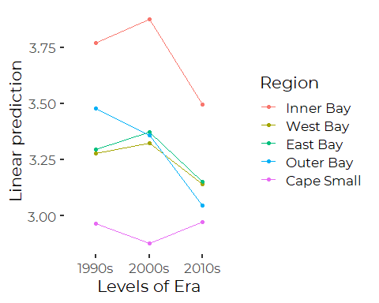

``` r
rm(pb_dat, pb_mod)
```

So, what we see is as RISE followed by a DROP, except in Cape Small.
This is a complex message to convey. Overall, we see a decline (since
the linear terms are significant). The exception is Cape Small, where
there is no trend.

``` r
ag_dat <- metals_data %>%
  filter(Parameter == 'Silver')
ag_mod <- lm(formula = log(Res_ML) ~ Era * Region, data = ag_dat)
summary(ag_mod)
#> 
#> Call:
#> lm(formula = log(Res_ML) ~ Era * Region, data = ag_dat)
#> 
#> Residuals:
#>      Min       1Q   Median       3Q      Max 
#> -2.61184 -0.28168  0.03654  0.32422  1.49216 
#> 
#> Coefficients:
#>                        Estimate Std. Error t value Pr(>|t|)    
#> (Intercept)            -1.14242    0.07675 -14.885  < 2e-16 ***
#> Era.L                  -0.04531    0.13829  -0.328 0.743486    
#> Era.Q                  -0.25782    0.12735  -2.025 0.044152 *  
#> RegionWest Bay         -0.45945    0.11004  -4.175 4.32e-05 ***
#> RegionEast Bay         -0.43441    0.11940  -3.638 0.000344 ***
#> RegionOuter Bay        -0.69297    0.11705  -5.920 1.26e-08 ***
#> RegionCape Small       -1.46616    0.15165  -9.668  < 2e-16 ***
#> Era.L:RegionWest Bay    0.38742    0.19763   1.960 0.051242 .  
#> Era.Q:RegionWest Bay    0.05739    0.18330   0.313 0.754524    
#> Era.L:RegionEast Bay    0.25386    0.21204   1.197 0.232546    
#> Era.Q:RegionEast Bay   -0.15408    0.20144  -0.765 0.445180    
#> Era.L:RegionOuter Bay  -0.19791    0.20402  -0.970 0.333101    
#> Era.Q:RegionOuter Bay  -0.20656    0.20147  -1.025 0.306375    
#> Era.L:RegionCape Small -0.50147    0.27196  -1.844 0.066571 .  
#> Era.Q:RegionCape Small -0.64752    0.25303  -2.559 0.011182 *  
#> ---
#> Signif. codes:  0 '***' 0.001 '**' 0.01 '*' 0.05 '.' 0.1 ' ' 1
#> 
#> Residual standard error: 0.5953 on 215 degrees of freedom
#> Multiple R-squared:  0.4185, Adjusted R-squared:  0.3806 
#> F-statistic: 11.05 on 14 and 215 DF,  p-value: < 2.2e-16
emmip(ag_mod, Region ~ Era, type = 'Response')
```

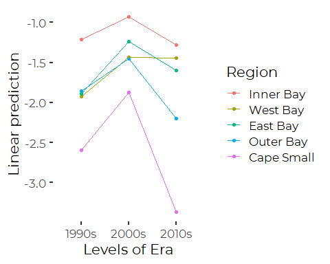

``` r
rm(ag_dat, ag_mod)
```

The story for silver is a strong up and down pattern at all sites except
West Bay, leading to a significant quadratic (but not linear) effect of
Era. Few interactions are significant. The only Region where a decline
is possible is Cape Small, but eyeing the parameters (-0.045 - 0.503) =
-0.548, with a standard error probably about 0.2, the drop is likely
significant, but we don’t pursue a formal calculation to confirm).

# Mixed Effects Models

A mixed effects model abstracts long-term unexplained differences among
sample locations (Substations) as sources of variation. We are not
INTERESTED in that variability, but we know it exists. This model
reduces the unexplained variation in the model, improving sensitivity to
other patterns.

## Mixed Effects Linear Regression

For our purposes, a linear regression makes better sense and uses
available data slightly more completely.

``` r
lmods <- list()
for (n in seq_along(mods$region_anova)) {
  metal <- mods$Parameter[n]
  tmp <- metals_data %>%
    filter(Parameter == metal) %>%
    filter(! is.na(Res_ML))
  mod <- lme(fixed = log(Res_ML) ~ Sample_Year + Region,
             random = ~ 1 | Substation,
             data = tmp,
             method = 'REML',
             na.action = na.omit)
  lmods[[metal]] <- mod
}
mods$me_lr_mod <- lmods
rm(lmods, tmp, mod)
```

Extract significant slopes by this model.

``` r
me_lr_p_vals <- lapply(mods$me_lr_mod,
               function(m) summary(m)$tTable[2,5])
names(me_lr_p_vals) <- mods$Parameter

me_lr_slopes <- lapply(mods$me_lr_mod,
               function(m) summary(m)$tTable[2,1])
names(me_lr_slopes) <- mods$Parameter
sig_me_lr <- names(me_lr_slopes[me_lr_p_vals<0.025])
me_lr_slopes[sig_me_lr]
#> $Arsenic
#> [1] -0.006958773
#> 
#> $Cadmium
#> [1] 0.009744972
#> 
#> $Chromium
#> [1] -0.006536973
#> 
#> $Copper
#> [1] -0.009199084
#> 
#> $Lead
#> [1] -0.01021979
#> 
#> $Nickel
#> [1] -0.007049378
#> 
#> $Selenium
#> [1] -0.02879852
#> 
#> $Zinc
#> [1] -0.007869143
```

By that test, we pick up a new matal with a declining pattern, Arsenic,
and all significant changes except Cadmium are decreasing.

## Mixed Effects ANOVA

We implement a step-wise model selection strategy here as well. We use
`method = 'ML'` to ensure appropriate comparison of models by AIC with
`stepAIC()`.

``` r
lmods <- list()
for (n in seq_along(mods$region_anova)) {
  metal <- mods$Parameter[n]
  tmp <- metals_data %>%
    filter(Parameter == metal) %>%
    filter(! is.na(Res_ML))
  mod <- lme(fixed = log(Res_ML) ~ Era * Region,
             random = ~ 1 | Substation,
             data = tmp,
             method = 'ML',
             na.action = na.omit)
  mod2 <- stepAIC(mod, trace = FALSE, direction = 'both')
  lmods[[metal]] <- mod2
}
mods$me_mod <- lmods
rm(lmods, tmp, mod, mod2)
```

### Selected Model Terms

(This is an alternative to extracting the call object that facilitates
searching for specific terms in the models via code.)

``` r
lapply(mods$me_mod,
               function(m) attr(terms(m), 'term.labels'))
#> $Arsenic
#> [1] "Era"    "Region"
#> 
#> $Cadmium
#> [1] "Era"        "Region"     "Era:Region"
#> 
#> $Chromium
#> [1] "Era"    "Region"
#> 
#> $Copper
#> [1] "Era"    "Region"
#> 
#> $Iron
#> [1] "Era"    "Region"
#> 
#> $Lead
#> [1] "Era"        "Region"     "Era:Region"
#> 
#> $Nickel
#> [1] "Era"    "Region"
#> 
#> $Selenium
#> [1] "Era"    "Region"
#> 
#> $Zinc
#> [1] "Era"    "Region"
#> 
#> $Mercury
#> [1] "Era"    "Region"
#> 
#> $Silver
#> [1] "Era"        "Region"     "Era:Region"
```

So by this model, ALL metals show temporal patterns (or at least AIC
suggests temporal terms are useful for prediction). However, not all
models show significant linear trends.

In an lme summary object, the coefficients table is called ‘tTable’, so
we can pull statistically significant linear temporal trends, as before

``` r
me_p_vals <- lapply(mods$me_mod,
               function(m) summary(m)$tTable[2,5])
names(me_p_vals) <- mods$Parameter
sig_me <- names(me_p_vals[me_p_vals<0.025])
sig_me
#> [1] "Arsenic"  "Chromium" "Copper"   "Lead"     "Nickel"   "Selenium" "Zinc"
```

``` r
me_slopes <- lapply(mods$me_mod,
               function(m) summary(m)$tTable[2,1])
names(me_slopes) <- mods$Parameter
me_slopes[me_p_vals<0.025]
#> $Arsenic
#> [1] -0.09778163
#> 
#> $Chromium
#> [1] -0.09138804
#> 
#> $Copper
#> [1] -0.1291463
#> 
#> $Lead
#> [1] -0.1901257
#> 
#> $Nickel
#> [1] -0.09811321
#> 
#> $Selenium
#> [1] -0.4101547
#> 
#> $Zinc
#> [1] -0.1134925
```

However, for cadmium, lead and silver, that test leaves out any detail
about trends buried in the interaction terms. We do not bother to review
those in detail here, since we will not use these results directly in
SoCB.

# Review of Temporal Trends

## Regressions

-   Regression,
-   Kendall’s Tau (standing in for the Robust Regression)
-   Mixed Effect Regression (questionable p values)

``` r
sig_lms
#> [1] "Chromium" "Lead"     "Nickel"   "Selenium" "Zinc"
sig_tau
#> [1] "Cadmium"  "Chromium" "Lead"     "Nickel"   "Zinc"
sig_me_lr
#> [1] "Arsenic"  "Cadmium"  "Chromium" "Copper"   "Lead"     "Nickel"   "Selenium"
#> [8] "Zinc"
```

-   Cadmium shows up as significant in the robust regression, and the
    mixed effects regression, but not the least squares linear model.

-   Selenium is significant by least squares, but not by robust
    regression (But the selenium data is complicated by what appear to
    be big changes in sensitivity of analytical methods in the 2010 era,
    so we will not report.)

-   The mixed effects regression pulls out more significant trends,
    including Arsenic, and Copper, which neither of the other linear
    models pulled out.

#### Which Metals Show up in All?

``` r
intersect(sig_lms,
          intersect(sig_tau,
                    sig_me_lr))
#> [1] "Chromium" "Lead"     "Nickel"   "Zinc"
```

## ANOVAs

Looking at linear main effects terms only. If we were going down this
path, we’d need to look at quadratic terms and interactions too.

``` r
sig_era
#> [1] "Chromium" "Lead"     "Nickel"   "Selenium" "Zinc"
sig_step
#> [1] "Chromium" "Copper"   "Lead"     "Nickel"   "Selenium" "Zinc"     "Mercury"
sig_me
#> [1] "Arsenic"  "Chromium" "Copper"   "Lead"     "Nickel"   "Selenium" "Zinc"
```

Results are quite similar, with best models based on stepwise regression
also identifying linear trends for copper and mercury.

#### Which Metals Show up in All?

``` r
intersect(sig_era,
          intersect(sig_step,
                    sig_me))
#> [1] "Chromium" "Lead"     "Nickel"   "Selenium" "Zinc"
```

# Selection of Final Models to Report

We could go with any of several models to report results.

1.  Selenium data is suspect, so we do not report on Selenium at all
    (See “Selenium\_reanalysis.Rmd”).

2.  Chromium, lead, nickel and zinc are identified by all models as
    showing trends.

3.  Robust linear regression adds Cadmium to that list.

4.  Mixed effects analysis (two flavors) adds several more, including
    arsenic, copper and mercury, but results are fairly model-dependent.

5.  For simplicity and consistency we chose to present results of the
    robust linear models as “closest” to a consensus of all models.
