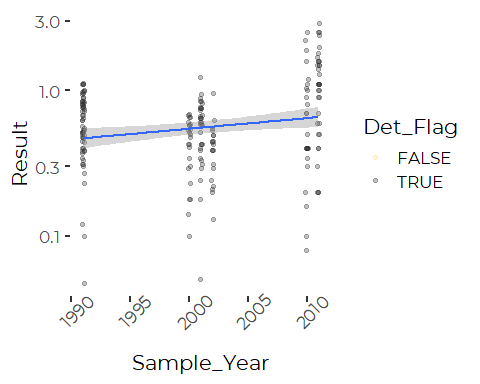
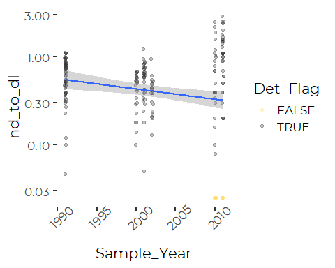
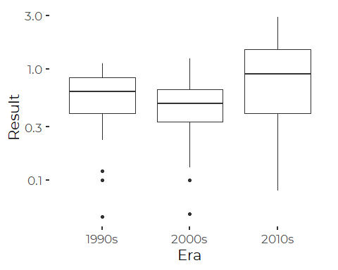
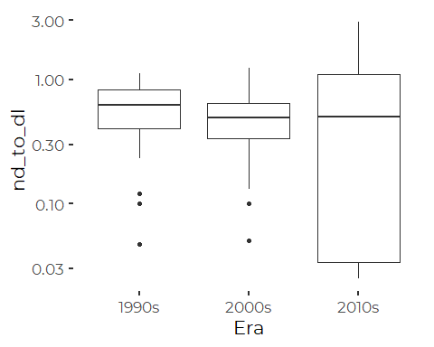
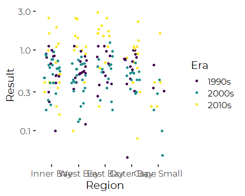
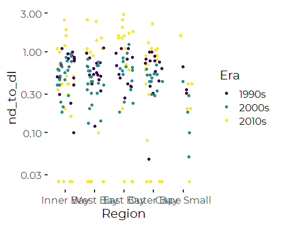
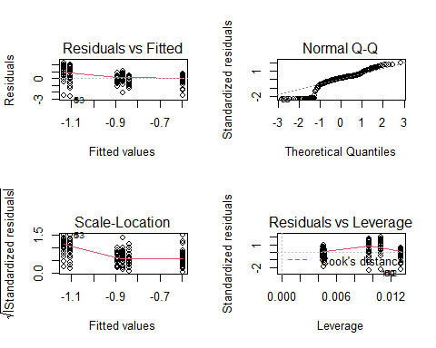

Trend Analysis for Metals
================
Curtis C. Bohlen, Casco Bay Estuary Partnership
March 29, 2021

-   [Introduction](#introduction)
-   [Load Data](#load-data)
    -   [Folder References](#folder-references)
    -   [Metals Data](#metals-data)
        -   [Units](#units)
    -   [Change Factor Levels](#change-factor-levels)
    -   [Select Selenium Data](#select-selenium-data)
    -   [Replace Non-detects with Detection
        Limits](#replace-non-detects-with-detection-limits)
-   [Plot Selenium](#plot-selenium)
    -   [Without Non-detects](#without-non-detects)
    -   [With the Non Detects](#with-the-non-detects)
-   [Linear Regression](#linear-regression)
    -   [Without the Non Detects](#without-the-non-detects)
    -   [With the Non Detects](#with-the-non-detects-1)
    -   [Model Diagnostic Plots](#model-diagnostic-plots)
-   [Robust Regression](#robust-regression)
    -   [With the Non Detects](#with-the-non-detects-2)
-   [ANOVA (Ordered Factor) Analysis](#anova-ordered-factor-analysis)
    -   [Era Model](#era-model)
        -   [With the Non Detects](#with-the-non-detects-3)
    -   [Region Model](#region-model)
        -   [Standard ANOVA](#standard-anova)
        -   [Welch’s Test](#welchs-test)
    -   [Stepwise Model Selection](#stepwise-model-selection)
        -   [Without the Non Detects](#without-the-non-detects-2)
        -   [With the Non Detects](#with-the-non-detects-6)
-   [Mixed Effects Models](#mixed-effects-models)
    -   [Mixed Effects Linear
        Regression](#mixed-effects-linear-regression)
        -   [Without the Non Detects](#without-the-non-detects-3)
        -   [With the Non Detects](#with-the-non-detects-7)
    -   [Mixed Effects ANOVA](#mixed-effects-anova)
        -   [Without the Non Detects](#without-the-non-detects-4)
    -   [With the Non Detects](#with-the-non-detects-8)


# Introduction

Casco Bay Estuary Partnership collected sediment samples in 1991, 1994,
2000, 2001, 2002, 2010, and 2011 to look at concentrations of toxic
contaminants in Casco Bay surface Sediments. These studies were
complemented by data collected by under the auspices of EPA’s the
National Coastal Assessment (NCA) and National Coastal Condition
Assessment (NCCA).

Chemicals studied included metals. Here we analyze long-term trends in
Selenium.

Lauren Brown, from Ramboll Scientific was kind enough to review a draft
of the Toxics chapter for State of Casco Bay.

She questioned some of our conclusions about selenium, which differed
from what Ramboll reported. Here, we reanalyze the Selenium data to
clarify what we and Ramboll found.

Our guess is that differences reflect different analytic choices, but it
would be good to confirm what is going on.

The comments from Brown in her review was as follows:

1.  Double check selenium trend. 2010/11 concentrations appear higher
    than the two previous sampling events. From the Ramboll report:

> For selenium, the significantly higher concentrations in the 2010–2011
> data are due to higher concentrations reported in four of the five
> regions, but most notably in West Bay and East Bay (Appendix A, Figure
> A-37). Minimum detected selenium concentrations are similar in all
> three sampling events, less than 0.08 µg/g in all cases, but the
> maximum concentration in the 2010-2011 data exceeds those from the
> previous sampling by a factor of nearly three (e.g., 1.1 µg/g and 1.2
> µg/g in 1991/1994 and 2000–2002, respectively, and 2.9 µg/g in
> 2010–2011) . Although this same trend was not apparent for most metals
> in this dataset, the apparent increase in selenium concentrations is
> confounded by differences in analytical methods. Therefore, it is
> possible that the differences among sampling periods could be due to
> differences in efficiencies between the different analytical methods
> used in each round of sampling or they could represent significantly
> higher concentrations of selenium throughout much of Casco Bay,
> particularly in the East Bay.

1.  Double check selenium regions. I think Cape Small is low and East
    Bay is high based on Ramboll report. (Showing graphic).

Note that a key difference between Ramboll’s analysis and ours is the
handling of non-detects. Ramboll dropped non-detects from consideration.
In our primary analysis we used a maximum likelihood method to estimate
the expected value of the (unobserved) non-detects, based on some
distributional assumptions (specifically,that the data are distributed
approximately lognormal). Here we make a more conservative assumption,
and replace the non-detects with their detection limits.

The core finding is that our conclusions depend on whether we include
non-detects in the analysis or not. Non-detects were common in 2010 and
2011. Ramboll’s decision to omit them biased their statistical analysis.
But more importantly, data from the 2010s looks qualitatively different
from earlier data in ways that suggest changes in laboratory practices
are probably important. In effect, analysis of the 2010 era Selenium
data may not be a good idea.

Throughout the following, we reprise our core statistical analyses on
the selenium data, repeating all analyses both omitting the non-detects,
and including them at the detection limits. \# Load Libraries

``` r
library(tidyverse)
#> -- Attaching packages --------------------------------------- tidyverse 1.3.0 --
#> v ggplot2 3.3.3     v purrr   0.3.4
#> v tibble  3.0.5     v dplyr   1.0.3
#> v tidyr   1.1.2     v stringr 1.4.0
#> v readr   1.4.0     v forcats 0.5.0
#> -- Conflicts ------------------------------------------ tidyverse_conflicts() --
#> x dplyr::filter() masks stats::filter()
#> x dplyr::lag()    masks stats::lag()
library(readxl)

library(mblm)
library(nlme)
#> 
#> Attaching package: 'nlme'
#> The following object is masked from 'package:dplyr':
#> 
#>     collapse
library(emmeans)

library(CBEPgraphics)
load_cbep_fonts()
theme_set(theme_cbep())

library(LCensMeans)
```

# Load Data

## Folder References

``` r
sibfldnm <- 'Derived_Data'
parent   <- dirname(getwd())
sibling  <- file.path(parent,sibfldnm)
niecefldnm <- 'Data_Subsets'
niece <- file.path(sibling,niecefldnm)
fn <- "metals.csv"
```

## Metals Data

``` r
metals_data <- read_csv(file.path(niece,fn),
                      col_types = cols(.default = col_character(),
                                        Sample_Year = col_double(),
                                        Replicate = col_integer(),
                                        CASRN = col_skip(),
                                        Result = col_double(),
                                        MDL = col_double(),
                                        RL = col_double(),
                                        Det_Flag = col_integer(),
                                        Qualifier = col_skip(),
                                        `QA Qualifier` = col_skip(),
                                        Reportable_Result = col_skip(),
                                        ERL = col_double(),
                                        ERM = col_double() )
                      ) %>%
  mutate(Replicate = Replicate == -1) %>%
  mutate(Det_Flag = Det_Flag == 1) %>%
  mutate(nd_flag = ! Det_Flag) %>%
  mutate(Parameter = if_else(Parameter == "Chromium (total)",
                             "Chromium",
                             Parameter))
```

### Units

See the “Review\_Data.Rmd” for details.

Ramboll Standardized units in the Access database, so, concentrations of
metals are expressed in *μ**g*/*g* dry weight (\~ ppm).

## Change Factor Levels

``` r
metals_data <- metals_data %>%
  mutate(LVL = factor(LVL, levels = c('Below ERL','Between ERL and ERM',
                                     'Above ERM'))) %>%
  mutate(Region = factor(Region, levels = c("Inner Bay",
                                            "West Bay",
                                            "East Bay",
                                            "Outer Bay",
                                            "Cape Small"))) %>%
  mutate(Era = ordered(Era, levels = c( "1990s", "2000s", "2010s" )))
```

## Select Selenium Data

``` r
metals_data <- metals_data %>%
  filter(Parameter == 'Selenium') %>%
  select(-Parameter)
```

## Replace Non-detects with Detection Limits

``` r
metals_data <- metals_data %>%
  mutate(nd_to_dl = if_else(nd_flag, MDL, Result))
```

# Plot Selenium

## Without Non-detects

``` r
metals_data %>%
  ggplot(aes(Sample_Year, Result)) +
  geom_jitter(aes(color = Det_Flag), width = 0.1, alpha = 0.3) +
  geom_smooth(method = 'lm') +
  scale_color_manual(values = cbep_colors()[2:3]) +
  scale_y_log10() +
  theme(axis.text.x = element_text(angle = 45))
#> `geom_smooth()` using formula 'y ~ x'
#> Warning: Removed 30 rows containing non-finite values (stat_smooth).
#> Warning: Removed 30 rows containing missing values (geom_point).
```



## With the Non Detects

``` r
metals_data %>%
  ggplot(aes(Sample_Year, nd_to_dl)) +
  geom_jitter(aes(color = Det_Flag), width = 0.1, alpha = 0.3) +
  geom_smooth(method = 'lm') +
  scale_color_manual(values = cbep_colors()[2:3]) +
  scale_y_log10() +
  theme(axis.text.x = element_text(angle = 45))
#> `geom_smooth()` using formula 'y ~ x'
#> Warning: Removed 9 rows containing non-finite values (stat_smooth).
#> Warning: Removed 9 rows containing missing values (geom_point).
```


Non-detects only occurred in the 2010s era, and they have a large effect
on the slope of the trend over time.

So what is clear any trend in selenium depends on how one handles the
non-detects. Omitting the non-detects generates an nominal INCREASE in
concentrations. Including them at the method detection limit (shown) or
at the maximum likelihood estimator (preferred, but not shown) results
in finding a nominal DECREASE.

``` r
metals_data %>%
  ggplot(aes(y = Result, x = Era)) +
  geom_boxplot() +
  scale_y_log10()
#> Warning: Removed 30 rows containing non-finite values (stat_boxplot).
```



``` r
metals_data %>%
  ggplot(aes(y = nd_to_dl, x = Era)) +
  geom_boxplot() +
  scale_y_log10()
#> Warning: Removed 9 rows containing non-finite values (stat_boxplot).
```



So what we see is that a simple regression or anova will, again, see
very different results depending on how you handle non-detects. This,
obviously, does not generate great confidence in the results. Also, we
end up with a serious problem with inhomogeneity of variances….

``` r
metals_data %>%
  ggplot(aes(y = Result, x = Region, color = Era)) +
  geom_jitter(width = .3, height = 0) +
  scale_y_log10()
#> Warning: Removed 30 rows containing missing values (geom_point).
```



``` r
metals_data %>%
 ggplot(aes(y = nd_to_dl, x = Region, color = Era)) +
  geom_jitter(width = .3, height = 0) +
  scale_y_log10()
#> Warning: Removed 9 rows containing missing values (geom_point).
```


The 2010s era data stands out as quite different, with both many higher
observations and many more non-detects.

# Linear Regression

On log-transformed data.

## Without the Non Detects

``` r
lr_mod_no_ND = lm(log(Result) ~ Sample_Year, data = metals_data)
anova(lr_mod_no_ND)
#> Analysis of Variance Table
#> 
#> Response: log(Result)
#>              Df Sum Sq Mean Sq F value   Pr(>F)   
#> Sample_Year   1  3.291  3.2913  6.8193 0.009708 **
#> Residuals   198 95.565  0.4827                    
#> ---
#> Signif. codes:  0 '***' 0.001 '**' 0.01 '*' 0.05 '.' 0.1 ' ' 1
summary(lr_mod_no_ND)
#> 
#> Call:
#> lm(formula = log(Result) ~ Sample_Year, data = metals_data)
#> 
#> Residuals:
#>      Min       1Q   Median       3Q      Max 
#> -2.40649 -0.36911  0.07176  0.49850  1.48655 
#> 
#> Coefficients:
#>              Estimate Std. Error t value Pr(>|t|)   
#> (Intercept) -34.08562   12.82624  -2.657  0.00852 **
#> Sample_Year   0.01674    0.00641   2.611  0.00971 **
#> ---
#> Signif. codes:  0 '***' 0.001 '**' 0.01 '*' 0.05 '.' 0.1 ' ' 1
#> 
#> Residual standard error: 0.6947 on 198 degrees of freedom
#>   (30 observations deleted due to missingness)
#> Multiple R-squared:  0.03329,    Adjusted R-squared:  0.02841 
#> F-statistic: 6.819 on 1 and 198 DF,  p-value: 0.009708
```

That shows a statistically significant increase in concentrations over
time.

## With the Non Detects

Let’s look at a regression where the non-detects are included in the
model at the detection limit.

``` r
lr_mod = lm(log(nd_to_dl) ~ Sample_Year, data = metals_data)
anova(lr_mod)
#> Analysis of Variance Table
#> 
#> Response: log(nd_to_dl)
#>              Df  Sum Sq Mean Sq F value   Pr(>F)   
#> Sample_Year   1   9.713  9.7130  7.8366 0.005577 **
#> Residuals   219 271.439  1.2394                    
#> ---
#> Signif. codes:  0 '***' 0.001 '**' 0.01 '*' 0.05 '.' 0.1 ' ' 1
summary(lr_mod)
#> 
#> Call:
#> lm(formula = log(nd_to_dl) ~ Sample_Year, data = metals_data)
#> 
#> Residuals:
#>     Min      1Q  Median      3Q     Max 
#> -2.5812 -0.3704  0.1913  0.5872  2.1992 
#> 
#> Coefficients:
#>              Estimate Std. Error t value Pr(>|t|)   
#> (Intercept) 52.888302  19.209493   2.753  0.00640 **
#> Sample_Year -0.026864   0.009596  -2.799  0.00558 **
#> ---
#> Signif. codes:  0 '***' 0.001 '**' 0.01 '*' 0.05 '.' 0.1 ' ' 1
#> 
#> Residual standard error: 1.113 on 219 degrees of freedom
#>   (9 observations deleted due to missingness)
#> Multiple R-squared:  0.03455,    Adjusted R-squared:  0.03014 
#> F-statistic: 7.837 on 1 and 219 DF,  p-value: 0.005577
```

That shows a statistically significant decrease over time.

## Model Diagnostic Plots

``` r
oldpar <- par()
par(mfrow = c(2,2))
plot(lr_mod)
```



``` r
par(oldpar)
#> Warning in par(oldpar): graphical parameter "cin" cannot be set
#> Warning in par(oldpar): graphical parameter "cra" cannot be set
#> Warning in par(oldpar): graphical parameter "csi" cannot be set
#> Warning in par(oldpar): graphical parameter "cxy" cannot be set
#> Warning in par(oldpar): graphical parameter "din" cannot be set
#> Warning in par(oldpar): graphical parameter "page" cannot be set
```

The model diagnostic plots are not great. We have a cluster of points at
the detection limits, and clear increase in variance for the lowest
predicted values – those from 2010 in this model.

# Robust Regression

We can conduct a robust regression, based on Theil-Sen slope estimators,
or (nearly equivalently) Kendall’s Tau.

We could not get the following to work inside a pipe or `lapply()` call,
so we fell back on using a loop. Also, `mblm()` does not like having a
log transform in the model formula, so we had to move the log transform
outside the call. \#\# Without the Non Detects

``` r
tmp <- metals_data %>%
    mutate(logres = log(Result)) %>%
  filter(! is.na(logres))

rlm_no_ND <- mblm(logres ~ Sample_Year, data = tmp)
summary(rlm_no_ND)
#> 
#> Call:
#> mblm(formula = logres ~ Sample_Year, dataframe = tmp)
#> 
#> Residuals:
#>      Min       1Q   Median       3Q      Max 
#> -2.42893 -0.40960  0.02541  0.43609  1.56472 
#> 
#> Coefficients:
#>               Estimate        MAD V value Pr(>|V|)   
#> (Intercept) -13.931151  82.427395    7745  0.00492 **
#> Sample_Year   0.006679   0.041257   11708  0.00637 **
#> ---
#> Signif. codes:  0 '***' 0.001 '**' 0.01 '*' 0.05 '.' 0.1 ' ' 1
#> 
#> Residual standard error: 0.6995 on 198 degrees of freedom
```

## With the Non Detects

``` r
tmp <- metals_data %>%
    mutate(logval = log(nd_to_dl)) %>%
  filter(! is.na(logval))
rlm <- mblm(logval ~ Sample_Year, data = tmp)
rm(tmp)
summary(rlm)
#> 
#> Call:
#> mblm(formula = logval ~ Sample_Year, dataframe = tmp)
#> 
#> Residuals:
#>     Min      1Q  Median      3Q     Max 
#> -2.8655 -0.4716  0.0000  0.4456  1.9018 
#> 
#> Coefficients:
#>             Estimate      MAD V value Pr(>|V|)   
#> (Intercept) 26.81069 85.85818   14998  0.00409 **
#> Sample_Year -0.01375  0.04296    9118  0.00345 **
#> ---
#> Signif. codes:  0 '***' 0.001 '**' 0.01 '*' 0.05 '.' 0.1 ' ' 1
#> 
#> Residual standard error: 1.132 on 219 degrees of freedom
```

So we see the same relationship, even with a resistant regression. The
conclusion depends on how you handle the non-detects.

# ANOVA (Ordered Factor) Analysis

## Era Model

We can implement a similar model, fitting Eras instead of Sample\_Years,
by fitting an ordered factor. The default coding for an ordered factor
splits the fit into linear and quadratic terms, which here is
appropriate. One should be aware, however, that the coding with only
three levels of an ordered factor contrasts the first and third levels,
effectively ignoring the intermediate one. Whether you consider that a
feature or a bug, will depend on your perspective. Under a similar
linear model, deviations from linear trend become part of the error
term. Here, it is fit as part of the quadratic term.

Our focus is on saying whether there are long term trends, so we are
principally interested in the linear term.

``` r
era_anova_no_ND = lm(log(Result) ~ Era, data = metals_data)
summary(era_anova_no_ND)
#> 
#> Call:
#> lm(formula = log(Result) ~ Era, data = metals_data)
#> 
#> Residuals:
#>     Min      1Q  Median      3Q     Max 
#> -2.4553 -0.3682  0.1290  0.4268  1.3452 
#> 
#> Coefficients:
#>             Estimate Std. Error t value Pr(>|t|)    
#> (Intercept) -0.56991    0.04775 -11.936  < 2e-16 ***
#> Era.L        0.22760    0.08588   2.650 0.008697 ** 
#> Era.Q        0.31474    0.07939   3.964 0.000103 ***
#> ---
#> Signif. codes:  0 '***' 0.001 '**' 0.01 '*' 0.05 '.' 0.1 ' ' 1
#> 
#> Residual standard error: 0.6707 on 197 degrees of freedom
#>   (30 observations deleted due to missingness)
#> Multiple R-squared:  0.1035, Adjusted R-squared:  0.09438 
#> F-statistic: 11.37 on 2 and 197 DF,  p-value: 2.124e-05
```

### With the Non Detects

``` r
era_anova = lm(log(nd_to_dl) ~ Era, data = metals_data)
summary(era_anova)
#> 
#> Call:
#> lm(formula = log(nd_to_dl) ~ Era, data = metals_data)
#> 
#> Residuals:
#>     Min      1Q  Median      3Q     Max 
#> -2.5355 -0.3771  0.2167  0.5615  2.2181 
#> 
#> Coefficients:
#>             Estimate Std. Error t value Pr(>|t|)    
#> (Intercept) -0.86087    0.07550 -11.402  < 2e-16 ***
#> Era.L       -0.38962    0.13308  -2.928  0.00378 ** 
#> Era.Q       -0.04161    0.12843  -0.324  0.74624    
#> ---
#> Signif. codes:  0 '***' 0.001 '**' 0.01 '*' 0.05 '.' 0.1 ' ' 1
#> 
#> Residual standard error: 1.113 on 218 degrees of freedom
#>   (9 observations deleted due to missingness)
#> Multiple R-squared:  0.03927,    Adjusted R-squared:  0.03046 
#> F-statistic: 4.456 on 2 and 218 DF,  p-value: 0.01269
```

So again, we see a difference in the sign of the linear trend term,
depending on how you handle the non-detects.

## Region Model

### Standard ANOVA

We compare results from standard ANOVA, which assumes uniform variances,
and Welch’s ANOVA, which does not. \#\#\#\# Without the Non Detects

``` r
region_anova_no_ND = lm(log(Result) ~ Region, data = metals_data)
summary(region_anova_no_ND)
#> 
#> Call:
#> lm(formula = log(Result) ~ Region, data = metals_data)
#> 
#> Residuals:
#>      Min       1Q   Median       3Q      Max 
#> -2.47231 -0.32497  0.02039  0.42425  1.72825 
#> 
#> Coefficients:
#>                   Estimate Std. Error t value Pr(>|t|)    
#> (Intercept)      -0.611813   0.090017  -6.797 1.27e-10 ***
#> RegionWest Bay   -0.006427   0.131684  -0.049  0.96112    
#> RegionEast Bay    0.291919   0.140178   2.082  0.03860 *  
#> RegionOuter Bay   0.026519   0.140178   0.189  0.85015    
#> RegionCape Small -0.646432   0.208883  -3.095  0.00226 ** 
#> ---
#> Signif. codes:  0 '***' 0.001 '**' 0.01 '*' 0.05 '.' 0.1 ' ' 1
#> 
#> Residual standard error: 0.6796 on 195 degrees of freedom
#>   (30 observations deleted due to missingness)
#> Multiple R-squared:  0.08892,    Adjusted R-squared:  0.07024 
#> F-statistic: 4.758 on 4 and 195 DF,  p-value: 0.001102
```

#### With the Non Detects

``` r
region_anova = lm(log(nd_to_dl) ~ Region, data = metals_data)
summary(region_anova)
#> 
#> Call:
#> lm(formula = log(nd_to_dl) ~ Region, data = metals_data)
#> 
#> Residuals:
#>     Min      1Q  Median      3Q     Max 
#> -3.1339 -0.2652  0.2762  0.6593  1.9581 
#> 
#> Coefficients:
#>                  Estimate Std. Error t value Pr(>|t|)    
#> (Intercept)       -0.8136     0.1433  -5.679 4.35e-08 ***
#> RegionWest Bay    -0.2282     0.2052  -1.112   0.2674    
#> RegionEast Bay     0.2586     0.2228   1.161   0.2470    
#> RegionOuter Bay   -0.1165     0.2199  -0.530   0.5966    
#> RegionCape Small  -0.6183     0.3316  -1.864   0.0636 .  
#> ---
#> Signif. codes:  0 '***' 0.001 '**' 0.01 '*' 0.05 '.' 0.1 ' ' 1
#> 
#> Residual standard error: 1.119 on 216 degrees of freedom
#>   (9 observations deleted due to missingness)
#> Multiple R-squared:  0.03806,    Adjusted R-squared:  0.02024 
#> F-statistic: 2.136 on 4 and 216 DF,  p-value: 0.07738
```

### Welch’s Test

This does not assume homogeneity of variances.

#### Without the Non Detects

``` r
region_welch_no_ND = oneway.test(log(Result) ~ Region, data = metals_data)

region_welch_no_ND
#> 
#>  One-way analysis of means (not assuming equal variances)
#> 
#> data:  log(Result) and Region
#> F = 3.4142, num df = 4.000, denom df = 61.551, p-value = 0.01382
```

#### With the Non Detects

``` r
region_welch = oneway.test(log(nd_to_dl) ~ Region, data = metals_data)

region_welch
#> 
#>  One-way analysis of means (not assuming equal variances)
#> 
#> data:  log(nd_to_dl) and Region
#> F = 2.1908, num df = 4.000, denom df = 69.317, p-value = 0.07895
```

So again, we see contradictory results of ANOVA depending on how we
address the non-detects.

## Stepwise Model Selection

### Without the Non Detects

``` r
  mod <- lm(log(Result) ~ Era * Region, data = metals_data)
  mod2 <- step(mod, trace = FALSE, direction = 'both')

  mod2$call
#> lm(formula = log(Result) ~ Era + Region, data = metals_data)
  anova(mod2)
#> Analysis of Variance Table
#> 
#> Response: log(Result)
#>            Df Sum Sq Mean Sq F value    Pr(>F)    
#> Era         2 10.230  5.1149 12.4041 8.553e-06 ***
#> Region      4  9.042  2.2604  5.4816 0.0003354 ***
#> Residuals 193 79.585  0.4124                      
#> ---
#> Signif. codes:  0 '***' 0.001 '**' 0.01 '*' 0.05 '.' 0.1 ' ' 1
  summary(mod2)
#> 
#> Call:
#> lm(formula = log(Result) ~ Era + Region, data = metals_data)
#> 
#> Residuals:
#>     Min      1Q  Median      3Q     Max 
#> -2.4308 -0.3516  0.1121  0.4161  1.4362 
#> 
#> Coefficients:
#>                   Estimate Std. Error t value Pr(>|t|)    
#> (Intercept)      -0.590854   0.085331  -6.924 6.34e-11 ***
#> Era.L             0.241284   0.082472   2.926 0.003850 ** 
#> Era.Q             0.313512   0.076264   4.111 5.83e-05 ***
#> RegionWest Bay    0.027220   0.124653   0.218 0.827376    
#> RegionEast Bay    0.282694   0.132479   2.134 0.034115 *  
#> RegionOuter Bay   0.006625   0.132700   0.050 0.960233    
#> RegionCape Small -0.673948   0.197498  -3.412 0.000784 ***
#> ---
#> Signif. codes:  0 '***' 0.001 '**' 0.01 '*' 0.05 '.' 0.1 ' ' 1
#> 
#> Residual standard error: 0.6422 on 193 degrees of freedom
#>   (30 observations deleted due to missingness)
#> Multiple R-squared:  0.1949, Adjusted R-squared:  0.1699 
#> F-statistic: 7.789 on 6 and 193 DF,  p-value: 1.623e-07
```

So `step()` drops the interaction term but retains both the main
effects.

### With the Non Detects

``` r
  mod <- lm(log(nd_to_dl) ~ Era * Region, data = metals_data)
  mod2 <- step(mod, trace = FALSE, direction = 'both')

  mod2$call
#> lm(formula = log(nd_to_dl) ~ Era + Region, data = metals_data)
  anova(mod2)
#> Analysis of Variance Table
#> 
#> Response: log(nd_to_dl)
#>            Df  Sum Sq Mean Sq F value  Pr(>F)  
#> Era         2  11.042  5.5210  4.5485 0.01163 *
#> Region      4  10.358  2.5895  2.1334 0.07777 .
#> Residuals 214 259.752  1.2138                  
#> ---
#> Signif. codes:  0 '***' 0.001 '**' 0.01 '*' 0.05 '.' 0.1 ' ' 1
  summary(mod2)
#> 
#> Call:
#> lm(formula = log(nd_to_dl) ~ Era + Region, data = metals_data)
#> 
#> Residuals:
#>     Min      1Q  Median      3Q     Max 
#> -2.8693 -0.3362  0.1620  0.5892  2.2308 
#> 
#> Coefficients:
#>                  Estimate Std. Error t value Pr(>|t|)    
#> (Intercept)      -0.78928    0.14156  -5.576 7.39e-08 ***
#> Era.L            -0.38328    0.13184  -2.907  0.00403 ** 
#> Era.Q            -0.04396    0.12745  -0.345  0.73049    
#> RegionWest Bay   -0.23628    0.20207  -1.169  0.24360    
#> RegionEast Bay    0.25872    0.21942   1.179  0.23967    
#> RegionOuter Bay  -0.11437    0.21694  -0.527  0.59861    
#> RegionCape Small -0.58578    0.32668  -1.793  0.07436 .  
#> ---
#> Signif. codes:  0 '***' 0.001 '**' 0.01 '*' 0.05 '.' 0.1 ' ' 1
#> 
#> Residual standard error: 1.102 on 214 degrees of freedom
#>   (9 observations deleted due to missingness)
#> Multiple R-squared:  0.07612,    Adjusted R-squared:  0.05021 
#> F-statistic: 2.938 on 6 and 214 DF,  p-value: 0.008927
```

So, what we see is that if we retain the non-detects, the slope of the
trend is negative and differences between regions are marginally
significant.

# Mixed Effects Models

A mixed effects model abstracts long-term unexplained differences among
sample locations (Substations) as sources of variation. We are not
INTERESTED in that variability, but we know it exists. This model
reduces the unexplained variation in the model, improving sensitivity to
other patterns.

## Mixed Effects Linear Regression

For our purposes, a linear regression makes better sense and uses
available data slightly more completely.

### Without the Non Detects

``` r
mod <- lme(fixed = log(Result) ~ Sample_Year + Region,
             random = ~ 1 | Substation,
             data = metals_data,
             method = 'REML',
             na.action = na.omit)
anova(mod)
#>             numDF denDF   F-value p-value
#> (Intercept)     1    96 122.35881  <.0001
#> Sample_Year     1    94   7.57890  0.0071
#> Region          4    96   4.84615  0.0013
```

``` r
summary(mod)
#> Linear mixed-effects model fit by REML
#>  Data: metals_data 
#>        AIC      BIC    logLik
#>   411.3347 437.3109 -197.6674
#> 
#> Random effects:
#>  Formula: ~1 | Substation
#>         (Intercept)  Residual
#> StdDev:   0.3454767 0.5575105
#> 
#> Fixed effects: log(Result) ~ Sample_Year + Region 
#>                      Value Std.Error DF   t-value p-value
#> (Intercept)      -33.35566 11.262401 96 -2.961683  0.0039
#> Sample_Year        0.01636  0.005628 94  2.907317  0.0045
#> RegionWest Bay     0.01116  0.148722 96  0.075036  0.9403
#> RegionEast Bay     0.30554  0.157666 96  1.937915  0.0556
#> RegionOuter Bay    0.05666  0.160983 96  0.351951  0.7256
#> RegionCape Small  -0.70849  0.222152 96 -3.189209  0.0019
#>  Correlation: 
#>                  (Intr) Smpl_Y RgnWsB RgnEsB RgnOtB
#> Sample_Year      -1.000                            
#> RegionWest Bay   -0.043  0.037                     
#> RegionEast Bay   -0.005 -0.001  0.443              
#> RegionOuter Bay  -0.062  0.057  0.436  0.409       
#> RegionCape Small  0.033 -0.037  0.313  0.297  0.288
#> 
#> Standardized Within-Group Residuals:
#>        Min         Q1        Med         Q3        Max 
#> -3.7537575 -0.5085479  0.0882188  0.5741770  2.1775937 
#> 
#> Number of Observations: 196
#> Number of Groups: 101
```

### With the Non Detects

``` r
mod <- lme(fixed = log(nd_to_dl) ~ Sample_Year + Region,
             random = ~ 1 | Substation,
             data = metals_data,
             method = 'REML',
             na.action = na.omit)
anova(mod)
#>             numDF denDF   F-value p-value
#> (Intercept)     1   106 110.66575  <.0001
#> Sample_Year     1   106   8.29837  0.0048
#> Region          4   102   2.65536  0.0372
```

``` r
summary(mod)
#> Linear mixed-effects model fit by REML
#>  Data: metals_data 
#>        AIC      BIC    logLik
#>   649.6835 676.3838 -316.8418
#> 
#> Random effects:
#>  Formula: ~1 | Substation
#>         (Intercept)  Residual
#> StdDev:   0.5055936 0.9314791
#> 
#> Fixed effects: log(nd_to_dl) ~ Sample_Year + Region 
#>                     Value Std.Error  DF    t-value p-value
#> (Intercept)      47.56163 17.214809 106  2.7628325  0.0068
#> Sample_Year      -0.02417  0.008599 106 -2.8110993  0.0059
#> RegionWest Bay   -0.16244  0.226393 102 -0.7175283  0.4747
#> RegionEast Bay    0.42620  0.244966 102  1.7398238  0.0849
#> RegionOuter Bay  -0.20529  0.240913 102 -0.8521402  0.3961
#> RegionCape Small -0.57788  0.344351 102 -1.6781683  0.0964
#>  Correlation: 
#>                  (Intr) Smpl_Y RgnWsB RgnEsB RgnOtB
#> Sample_Year      -1.000                            
#> RegionWest Bay   -0.015  0.009                     
#> RegionEast Bay   -0.017  0.011  0.441              
#> RegionOuter Bay  -0.030  0.024  0.448  0.414       
#> RegionCape Small  0.030 -0.034  0.313  0.289  0.294
#> 
#> Standardized Within-Group Residuals:
#>        Min         Q1        Med         Q3        Max 
#> -2.5809862 -0.2822515  0.1259289  0.5129131  1.9421641 
#> 
#> Number of Observations: 214
#> Number of Groups: 107
```

## Mixed Effects ANOVA

### Without the Non Detects

``` r
mod <- lme(fixed = log(Result) ~ Era + Region,
             random = ~ 1 | Substation,
             data = metals_data,
             method = 'REML',
             na.action = na.omit)
anova(mod)
#>             numDF denDF   F-value p-value
#> (Intercept)     1    96 134.04221  <.0001
#> Era             2    93  13.65190  <.0001
#> Region          4    96   5.28653   7e-04
```

``` r
summary(mod)
#> Linear mixed-effects model fit by REML
#>  Data: metals_data 
#>        AIC      BIC    logLik
#>   393.4946 422.6703 -187.7473
#> 
#> Random effects:
#>  Formula: ~1 | Substation
#>         (Intercept) Residual
#> StdDev:   0.3296506 0.533177
#> 
#> Fixed effects: log(Result) ~ Era + Region 
#>                       Value  Std.Error DF   t-value p-value
#> (Intercept)      -0.5888761 0.09761000 96 -6.032948  0.0000
#> Era.L             0.2413110 0.07476595 93  3.227551  0.0017
#> Era.Q             0.2965263 0.06753546 93  4.390676  0.0000
#> RegionWest Bay    0.0239180 0.14212178 96  0.168292  0.8667
#> RegionEast Bay    0.2918017 0.15067344 96  1.936650  0.0557
#> RegionOuter Bay   0.0300378 0.15382646 96  0.195271  0.8456
#> RegionCape Small -0.7229230 0.21231423 96 -3.404967  0.0010
#>  Correlation: 
#>                  (Intr) Era.L  Era.Q  RgnWsB RgnEsB RgnOtB
#> Era.L            -0.008                                   
#> Era.Q             0.066  0.057                            
#> RegionWest Bay   -0.683  0.039  0.020                     
#> RegionEast Bay   -0.646  0.000 -0.022  0.443              
#> RegionOuter Bay  -0.634  0.047 -0.033  0.435  0.410       
#> RegionCape Small -0.458 -0.040 -0.014  0.313  0.297  0.289
#> 
#> Standardized Within-Group Residuals:
#>        Min         Q1        Med         Q3        Max 
#> -4.0895649 -0.4392499  0.1810585  0.5599934  2.0218855 
#> 
#> Number of Observations: 196
#> Number of Groups: 101
```

## With the Non Detects

``` r
mod <- lme(fixed = log(nd_to_dl) ~ Era + Region,
             random = ~ 1 | Substation,
             data = metals_data,
             method = 'REML',
             na.action = na.omit)
summary(mod)
#> Linear mixed-effects model fit by REML
#>  Data: metals_data 
#>        AIC      BIC    logLik
#>   648.2027 678.1972 -315.1013
#> 
#> Random effects:
#>  Formula: ~1 | Substation
#>         (Intercept)  Residual
#> StdDev:   0.5055669 0.9322001
#> 
#> Fixed effects: log(nd_to_dl) ~ Era + Region 
#>                       Value Std.Error  DF   t-value p-value
#> (Intercept)      -0.8060668 0.1567514 105 -5.142326  0.0000
#> Era.L            -0.3486371 0.1191138 105 -2.926923  0.0042
#> Era.Q            -0.0141841 0.1137466 105 -0.124699  0.9010
#> RegionWest Bay   -0.1634795 0.2264980 102 -0.721770  0.4721
#> RegionEast Bay    0.4228547 0.2451053 102  1.725196  0.0875
#> RegionOuter Bay  -0.2015009 0.2412957 102 -0.835079  0.4056
#> RegionCape Small -0.5758865 0.3445479 102 -1.671427  0.0977
#>  Correlation: 
#>                  (Intr) Era.L  Era.Q  RgnWsB RgnEsB RgnOtB
#> Era.L            -0.053                                   
#> Era.Q             0.044 -0.041                            
#> RegionWest Bay   -0.689  0.009  0.006                     
#> RegionEast Bay   -0.638  0.016 -0.010  0.441              
#> RegionOuter Bay  -0.650  0.022 -0.049  0.447  0.414       
#> RegionCape Small -0.452 -0.034 -0.013  0.313  0.289  0.294
#> 
#> Standardized Within-Group Residuals:
#>        Min         Q1        Med         Q3        Max 
#> -2.5710309 -0.2728354  0.1239915  0.5088590  1.9490517 
#> 
#> Number of Observations: 214
#> Number of Groups: 107
```
