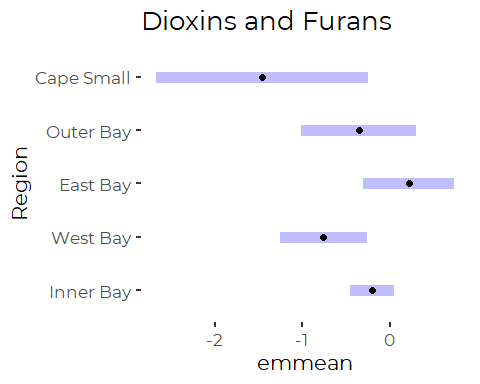

Analysis of Selected Sums and Totals of Contaminants
================
Curtis C. Bohlen, Casco Bay Estuary Partnership
03/30/2021

-   [Introduction](#introduction)
-   [Load Libraries](#load-libraries)
-   [Load Data](#load-data)
    -   [Folder References](#folder-references)
    -   [Sums Data](#sums-data)
        -   [Sums Data Caveates](#sums-data-caveates)
        -   [Change Factor Levels](#change-factor-levels)
        -   [Delete Unused Parameters](#delete-unused-parameters)
        -   [Reexpress Dioxins and Furans in
            PPB](#reexpress-dioxins-and-furans-in-ppb)
-   [Define Color Scale](#define-color-scale)
-   [Preliminary Graphics](#preliminary-graphics)
-   [Region Only ANOVA](#region-only-anova)
    -   [Welches ANOVA](#welches-anova)
    -   [Standard ANOVA](#standard-anova)
-   [Linear Regression Model](#linear-regression-model)
    -   [Refit Without Interaction](#refit-without-interaction)
    -   [Extract Marginal Means](#extract-marginal-means)
    -   [Alteratively, Plot Pairwise
        Comparisons](#alteratively-plot-pairwise-comparisons)
-   [Two-Way ANOVA (Ordered Factor)
    Analysis](#two-way-anova-ordered-factor-analysis)
    -   [Stepwise Model Selection](#stepwise-model-selection)
    -   [Fit Two Way Models](#fit-two-way-models)
    -   [Model Diagnostics](#model-diagnostics)
-   [LMER Models](#lmer-models)
-   [Discussion](#discussion)
    -   [Tabular Summaries of Pairwise
        Comparisons](#tabular-summaries-of-pairwise-comparisons)
        -   [Region ANOVA](#region-anova)
        -   [Linear Regression](#linear-regression)
        -   [Two Way ANOVA](#two-way-anova)
        -   [Full LMER Model](#full-lmer-model)


# Introduction

Casco Bay Estuary Partnership collected sediment samples in 1991, 1994,
2000, 2001, 2002, 2010, and 2011 to look at concentrations of toxic
contaminants in Casco Bay surface Sediments. These studies were
complemented by data collected by under the auspices of EPA’s the
National Coastal Assessment (NCA) and National Coastal Condition
Assessment (NCCA).

Chemicals studied included metals, polycyclic aromatic hydrocarbons
(PAHs), polychlorinated biphenyls (PCBs), organochlorine pesticides,
dioxins and furans, and organotins. These contaminants are all
persistent in the marine environment.

In this notebook, we conduct analyses of differences among our selected
sums of organic contaminants, principally by region. This expands upon
and double checks analysis of regions reported in
“Sums\_Trend\_Analysis.Rmd”. We added it to confirm patterns initially
reported in State of Casco Bay that reviewers found uncertain or
confusing.

# Load Libraries

``` r
library(tidyverse)
#> -- Attaching packages --------------------------------------- tidyverse 1.3.0 --
#> v ggplot2 3.3.3     v purrr   0.3.4
#> v tibble  3.0.5     v dplyr   1.0.3
#> v tidyr   1.1.2     v stringr 1.4.0
#> v readr   1.4.0     v forcats 0.5.0
#> -- Conflicts ------------------------------------------ tidyverse_conflicts() --
#> x dplyr::filter() masks stats::filter()
#> x dplyr::lag()    masks stats::lag()
library(readxl)

library(nlme)
#> 
#> Attaching package: 'nlme'
#> The following object is masked from 'package:dplyr':
#> 
#>     collapse
library(emmeans)

library(CBEPgraphics)
load_cbep_fonts()
theme_set(theme_cbep())

library(LCensMeans)
```

# Load Data

## Folder References

``` r
sibfldnm <- 'Derived_Data'
parent   <- dirname(getwd())
sibling  <- file.path(parent,sibfldnm)
niecefldnm <- 'Data_Subsets'
niece <- file.path(sibling,niecefldnm)
fn <- "sums_totals.csv"

# dir.create(file.path(getwd(), 'figures'), showWarnings = FALSE)
```

## Sums Data

Note that we are loading pre-processed data from the derived data file
here. See “prepare\_Data.Rmd” for details of pre-processing. The source
data her appears to have omitted “non detects”

``` r
sums_data <- read_csv(file.path(niece,fn),
                      col_types = cols(.default = col_character(),
                                        Sample_Year = col_double(),
                                        Replicate = col_integer(),
                                        CASRN = col_skip(),
                                        Result = col_double(),
                                        MDL = col_skip(),
                                        RL = col_skip(),
                                        Det_Flag = col_skip(),
                                        Qualifier = col_skip(),
                                        `QA Qualifier` = col_skip(),
                                        Reportable_Result = col_skip(),
                                        ERL = col_double(),
                                        ERM = col_double() )
                      ) %>%
  mutate(Replicate = Replicate == -1)
```

### Sums Data Caveates

See the “Review\_Data.Rmd” and “Review\_Sums\_Data.Rmd” files for
details.

Sums are defined in Table 4 of the Ramboll report, available in the
“2017 Casco Bay Sediment Report Tables FINAL.xlsx” file in the
“Original\_Data” folder, and (implicitly) in the “SumGroups.xlsx” file
in the same folder.

**The metadata is not entirely clear, but it appears (from examining the
Access database) that these sums omit non-detects, effectively equating
non-detects to zero. That is inconsistent with how we handled
non-detects in the other toxics data sets. Omitting the non-detects in
this way biases results upward, with the effect larger when there are
many non-detects.**

Many observations from 2010 and 2011 are zeros or NAs, because of high
detection limits. This is especially problem for data on Pesticides,
PCBs, and Butyltins in 2010 and 2011. Effectively, we have no data on
PCBs and Pesticides, and very little data on Butyltins from 2010 and
2011.

Because of different analytic methods used in different years, sums
include a relatively small consistent subset of parameters, so sums
reported here may not be fully compatible with available benchmarks.

Ramboll standardized units in the Access database, so, most sums are
expressed in ng/g dry weight (\~ ppb). The Dioxins and Furans are
expressed in ng/kg, or pg/g or approximately parts per trillion. To
simplify graphics, we re-express the Dioxin and Furan values in PPB,
below.

There are no SQuiRTs for Dioxins and Furans. Instead, Ramboll also
expressed them in TEQ – Toxic equivalents. Toxic equivalents provide a
way to estimate the cumulative toxic effect of a mixture of related
chemicals by weighting each compound by its relative toxic effect,
compared to some reference compound (conventionally TCDD).

### Change Factor Levels

``` r
sums_data <- sums_data %>%

  mutate(Parameter = factor(Parameter,
                            levels = c(
                              "Butyltin (mono+di+tri)",
                              "CDD/CDF (total)",
                              "Chlordane (total)",
                              "DDT+DDE+DDD (sum)",
                              "PAHs (High MW)",
                              "PAHs (Low MW)",
                              "PAHs (total)",
                              "PCBs (total)",
                              "Pesticides (total)"),
                            labels = c("Butyltins",
                                       "Dioxins and Furans",
                                       "Chlordanes",
                                       "DDT Residues",
                                       "High MW PAHs",
                                       "Low MW PAHs",
                                       "Total PAHs",
                                       "Total PCBs",
                                       "Pesticides"))) %>%
  mutate(LVL = factor(LVL, levels = c('Below ERL','Between ERL and ERM',
                                     'Above ERM'))) %>%
  mutate(Region = factor(Region, levels = c("Inner Bay",
                                            "West Bay",
                                            "East Bay",
                                            "Outer Bay",
                                            "Cape Small")))
```

### Delete Unused Parameters

To simplify presentation for State of Casco Bay, we will not report all
totals. we remove unused data here.

``` r
sums_data <- sums_data %>%
  filter(! Parameter %in% c("Chlordanes", "High MW PAHs",
                            "Low MW PAHs", "Pesticides")) %>%
  mutate(Parameter = factor(Parameter,
                            levels = c("Butyltins",
                                       "Dioxins and Furans",
                                       "Total PAHs",
                                       "Total PCBs",
                                       "DDT Residues"
                                       )))
```

### Reexpress Dioxins and Furans in PPB

``` r
sums_data <- sums_data %>%
  mutate(Result = if_else(Parameter == "Dioxins and Furans",
                          Result/1000,
                          Result))
```

# Define Color Scale

One reviewer pointed to possible confusion because of use of red as a
color for NA values, with a gray as one of our scale colors. That came
from use of our `cbep_colors()` color function. They suggested reversing
those color choices. Another alternative would be to use a portion of
our `cbep_colors2()` function’s sequential color range. But the latter
choice is complicated, as the sequential colors are sometimes fairly
similar, despite being spread out on a luminance scale.

We follow the reviewer’s suggestion, and create a color scale for these
graphics.

``` r
# First line is not necessary, but we like to keep color formats consistent....
fb <- rgb(t(col2rgb('firebrick')), maxColorValue = 255)
tox_colors <- c(cbep_colors()[1:2], fb)
na_color <- cbep_colors()[3]
rm(fb)
```

# Preliminary Graphics

``` r
sums_data %>%
  ggplot(aes(x = Era, y = Result, color = LVL)) +
  geom_jitter() +
  scale_color_manual(name = '', values = tox_colors, na.value = na_color,
                     labels = c('Below ERL','Between ERL and ERM',
                                     'Above ERM', "No Reference Defined")) +
  
  facet_wrap(~Parameter) +
  theme_cbep(base_size = 10) +
  scale_y_log10(breaks = scales::trans_breaks("log10", function(x) 100^x),
              labels = scales::trans_format("log10",
                                            scales::math_format(10^.x)))
#> Warning: Removed 230 rows containing missing values (geom_point).
```


``` r
sums_data %>%
  ggplot(aes(x = Region, y = Result, color = LVL)) +
  geom_jitter() +
  facet_wrap(~Parameter, ncol = 5, ) +
  
  scale_color_manual(name = '', values = tox_colors, na.value = na_color,
                     labels = c('Below ERL','Between ERL and ERM',
                                     'Above ERM', "No Reference Defined")) +
  
  theme_cbep(base_size = 10) +
  scale_y_log10(breaks = scales::trans_breaks("log10", function(x) 100^x),
              labels = scales::trans_format("log10", 
                                            scales::math_format(10^.x))) +
  theme(axis.text.x = element_text(angle = 90)) +
  theme(legend.position = 'bottom')
#> Warning: Removed 230 rows containing missing values (geom_point).
```


# Region Only ANOVA

We begin by looking at the simplest possible model, one that ignores
sampling heterogeneity over time and space. This is the model that
Ramboll emphasized in their report.

We compare results from standard ANOVA, which assumes uniform variances,
and Welch’s ANOVA, which does not.

``` r
mods <- sums_data %>%
  group_by(Parameter) %>%
  nest() %>%
  mutate(region_anova = lapply(data,
                      function(df) lm(log(Result) ~ Region, data = df)),
         region_welch = lapply(data,
                      function(df) oneway.test(log(Result) ~ Region, 
                                               data = df)))
```

We extract p values for both models.

For the ANOVA we pull the p value from the ANOVA table, rather than the
summary, because we want to an overall test for inequality across all
regions. ’summary.lm()`provides an array, but`anova.lm()\` produces a
data frame, with non-syntactic variable names.

For Welch’s Test, we directly pull a p value from the `htest` object
returned by the function call.

``` r
region_p_vals = lapply(mods$region_anova, function(t) anova(t)$`Pr(>F)`[1])
names(region_p_vals) <- mods$Parameter

welch_p_vals = lapply(mods$region_welch , function(t) t$p.value)
names(welch_p_vals) <- mods$Parameter
```

### Welches ANOVA

``` r
welch_p_vals
#> $`Dioxins and Furans`
#> [1] 2.858928e-08
#> 
#> $Butyltins
#> [1] 0.04587341
#> 
#> $`Total PAHs`
#> [1] 3.876709e-09
#> 
#> $`Total PCBs`
#> [1] 1.514415e-08
#> 
#> $`DDT Residues`
#> [1] 2.496977e-14
```

All show significant regional patterns. Unfortunately, there is no easy
way to examine pairwise comparisons among groups using the Welch’s Test,
as what is returned is not a linear model, but an `htest` object, which
is much more limited in terms of its contents.

The point here is that heterogeneity of variances is an issue with these
data, although there is little we can do about it at this point, except
be aware and treat all reported p values as somewhat suspect.

### Standard ANOVA

``` r
region_p_vals
#> $`Dioxins and Furans`
#> [1] 0.07918589
#> 
#> $Butyltins
#> [1] 0.002144437
#> 
#> $`Total PAHs`
#> [1] 2.110598e-11
#> 
#> $`Total PCBs`
#> [1] 2.674266e-11
#> 
#> $`DDT Residues`
#> [1] 3.08581e-22
```

All EXCEPT Dioxins and Furans show significant regional patterns, and
even Dioxins and Furans are close to significant.

``` r
for (n in seq_along(mods$Parameter)) {
  param <- mods$Parameter[n]
  emm <- emmeans(mods$region_anova[[n]], ~ Region, type = 'Response')
  print(pwpp(emm, type = "response") + ggtitle(param))
}
```


So, by this model:

| Parameter          | Result                                                                                               |
|--------------------|------------------------------------------------------------------------------------------------------|
| Butyltins          | Cape Small &lt; Inner Bay                                                                            |
| DDT Residues       | Cape Small &lt; West Bay, Outer Bay, East Bay &lt; Inner Bay                                         |
| Dioxins and Furans | No differences among regions                                                                         |
| Total PAHs         | Cape Small and West Bay &lt; East Bay and Inner Bay; Cape Small &lt; Outer Bay                       |
| Total PCBs         | Cape Small &lt; Outer Bay, East Bay and Inner Bay; West Bay &lt; Inner Bay; Outer Bay &lt; Inner bay |

# Linear Regression Model

The first way we can incorporate differences in time is to fit a linear
regression that accounts for when samples were collected. Note that this
fits ONLY a linear term, and thus dos not fully account for differences
in sampling history between Eras. We have no reason to believe
differences by when sampling occurred are linear for all parameters.

``` r
mods <- mods %>%
  mutate(lr_mod = lapply(data,
                      function(df) lm(log(Result) ~ Sample_Year * Region, 
                                      data = df)))
```

``` r
mods$Parameter
#> [1] Dioxins and Furans Butyltins          Total PAHs         Total PCBs        
#> [5] DDT Residues      
#> Levels: Butyltins Dioxins and Furans Total PAHs Total PCBs DDT Residues
lapply(mods$lr_mod,anova)
#> [[1]]
#> Analysis of Variance Table
#> 
#> Response: log(Result)
#>                    Df Sum Sq Mean Sq F value    Pr(>F)    
#> Sample_Year         1 59.173  59.173 84.2497 1.412e-13 ***
#> Region              4  8.577   2.144  3.0530   0.02238 *  
#> Sample_Year:Region  4  5.757   1.439  2.0493   0.09699 .  
#> Residuals          69 48.462   0.702                      
#> ---
#> Signif. codes:  0 '***' 0.001 '**' 0.01 '*' 0.05 '.' 0.1 ' ' 1
#> 
#> [[2]]
#> Analysis of Variance Table
#> 
#> Response: log(Result)
#>                    Df  Sum Sq Mean Sq F value    Pr(>F)    
#> Sample_Year         1 14.6497 14.6497 28.6177 2.557e-06 ***
#> Region              4  8.5170  2.1292  4.1594  0.005767 ** 
#> Sample_Year:Region  3  3.1999  1.0666  2.0836  0.115069    
#> Residuals          47 24.0598  0.5119                      
#> ---
#> Signif. codes:  0 '***' 0.001 '**' 0.01 '*' 0.05 '.' 0.1 ' ' 1
#> 
#> [[3]]
#> Analysis of Variance Table
#> 
#> Response: log(Result)
#>                     Df  Sum Sq Mean Sq  F value Pr(>F)    
#> Sample_Year          1 161.698 161.698 150.7632 <2e-16 ***
#> Region               4 131.858  32.964  30.7352 <2e-16 ***
#> Sample_Year:Region   4   7.781   1.945   1.8136 0.1273    
#> Residuals          215 230.594   1.073                    
#> ---
#> Signif. codes:  0 '***' 0.001 '**' 0.01 '*' 0.05 '.' 0.1 ' ' 1
#> 
#> [[4]]
#> Analysis of Variance Table
#> 
#> Response: log(Result)
#>                     Df  Sum Sq Mean Sq F value    Pr(>F)    
#> Sample_Year          1  46.776  46.776 58.8786 3.290e-12 ***
#> Region               4  84.734  21.183 26.6646 3.228e-16 ***
#> Sample_Year:Region   4   3.973   0.993  1.2504    0.2929    
#> Residuals          132 104.866   0.794                      
#> ---
#> Signif. codes:  0 '***' 0.001 '**' 0.01 '*' 0.05 '.' 0.1 ' ' 1
#> 
#> [[5]]
#> Analysis of Variance Table
#> 
#> Response: log(Result)
#>                     Df  Sum Sq Mean Sq F value Pr(>F)    
#> Sample_Year          1   0.039   0.039  0.0418 0.8383    
#> Region               4 150.355  37.589 39.8159 <2e-16 ***
#> Sample_Year:Region   4   2.734   0.683  0.7239 0.5771    
#> Residuals          131 123.673   0.944                   
#> ---
#> Signif. codes:  0 '***' 0.001 '**' 0.01 '*' 0.05 '.' 0.1 ' ' 1
```

So Regions are statistically significant for all the regression models,
even though we did not fit a quadratic term. and interactions are not WE
replace all models with a simpler, non-interaction model.

## Refit Without Interaction

``` r
mods <- mods %>%
 mutate(lr_mod = lapply(data,
                      function(df) lm(log(Result) ~ Sample_Year + Region, 
                                      data = df)))
```

``` r
mods$Parameter
#> [1] Dioxins and Furans Butyltins          Total PAHs         Total PCBs        
#> [5] DDT Residues      
#> Levels: Butyltins Dioxins and Furans Total PAHs Total PCBs DDT Residues
lapply(mods$lr_mod,anova)
#> [[1]]
#> Analysis of Variance Table
#> 
#> Response: log(Result)
#>             Df Sum Sq Mean Sq F value    Pr(>F)    
#> Sample_Year  1 59.173  59.173  79.669 2.566e-13 ***
#> Region       4  8.577   2.144   2.887   0.02812 *  
#> Residuals   73 54.219   0.743                      
#> ---
#> Signif. codes:  0 '***' 0.001 '**' 0.01 '*' 0.05 '.' 0.1 ' ' 1
#> 
#> [[2]]
#> Analysis of Variance Table
#> 
#> Response: log(Result)
#>             Df Sum Sq Mean Sq F value   Pr(>F)    
#> Sample_Year  1 14.650 14.6497 26.8707 3.93e-06 ***
#> Region       4  8.517  2.1292  3.9055 0.007764 ** 
#> Residuals   50 27.260  0.5452                     
#> ---
#> Signif. codes:  0 '***' 0.001 '**' 0.01 '*' 0.05 '.' 0.1 ' ' 1
#> 
#> [[3]]
#> Analysis of Variance Table
#> 
#> Response: log(Result)
#>              Df Sum Sq Mean Sq F value    Pr(>F)    
#> Sample_Year   1 161.70 161.698 148.556 < 2.2e-16 ***
#> Region        4 131.86  32.964  30.285 < 2.2e-16 ***
#> Residuals   219 238.38   1.088                      
#> ---
#> Signif. codes:  0 '***' 0.001 '**' 0.01 '*' 0.05 '.' 0.1 ' ' 1
#> 
#> [[4]]
#> Analysis of Variance Table
#> 
#> Response: log(Result)
#>              Df  Sum Sq Mean Sq F value    Pr(>F)    
#> Sample_Year   1  46.776  46.776  58.448 3.391e-12 ***
#> Region        4  84.734  21.183  26.470 3.049e-16 ***
#> Residuals   136 108.840   0.800                      
#> ---
#> Signif. codes:  0 '***' 0.001 '**' 0.01 '*' 0.05 '.' 0.1 ' ' 1
#> 
#> [[5]]
#> Analysis of Variance Table
#> 
#> Response: log(Result)
#>              Df  Sum Sq Mean Sq F value Pr(>F)    
#> Sample_Year   1   0.039   0.039  0.0422 0.8376    
#> Region        4 150.355  37.589 40.1442 <2e-16 ***
#> Residuals   135 126.407   0.936                   
#> ---
#> Signif. codes:  0 '***' 0.001 '**' 0.01 '*' 0.05 '.' 0.1 ' ' 1
```

So region is Statistically Significant for all Parameters.

## Extract Marginal Means

``` r
mods <- mods %>%
 mutate(lr_emms = lapply(lr_mod, 
                         function(m) emmeans(m, pairwise ~ Region, 
                                             at= list(Year = 2000),
                                             )))
```

``` r
for (p in mods$Parameter) {
  row  = mods[mods$Parameter == p,]
  print(plot(row$lr_emms[[1]]) + ggtitle(p))
}
```



## Alteratively, Plot Pairwise Comparisons

``` r
for (p in mods$Parameter) {
  row  <- mods[mods$Parameter == p,]
  emm <- emmeans(row$lr_mod[[1]], ~ Region, type = 'Response')
  print(pwpp(emm, type = "response") + ggtitle(p))
}
```


So, by this model:

| Parameter          | Result                                                               |
|--------------------|----------------------------------------------------------------------|
| Butyltins          | No differences between regions                                       |
| DDT Residues       | Cape Small &lt; other regions &lt; Inner bay                         |
| Dioxins and Furans | No differences among regions                                         |
| Total PAHs         | Cape Small &lt; Outer Bay and West Bay &lt; East Bay and Inner Bay   |
| Total PCBs         | Cape Small &lt; Other regions &lt; Inner bay; West Bay &lt; East Bay |

# Two-Way ANOVA (Ordered Factor) Analysis

## Stepwise Model Selection

We used stepwise model selection by AIC, using the `step()` function to
identify whether we needed interaction terms in any of our ANOVA models.
All interaction terms were omitted. The “best” model (BY AIC) for all
parameters except DDT residues included Region and Era terms. For DDT,
the “Best” Model omitted the Era Term. The stepwise analysis is not
shown. This is similar to what we observed with the regression models.

The default ordered factor analysis with three ordered factors
effectively fits a linear relationship between the first and third
levels of the factor (here “Era”) and an adjustment term to fit the
middle (second) level of the factor. Thus this model is better able to
fitting data to the different Eras than the regression model we explored
previously.

## Fit Two Way Models

``` r
mods <- mods %>%
  mutate(two_way_anova = lapply(data,
                      function(df) lm(log(Result) ~ Region + Era, data = df)))

two_way_p_vals = lapply(mods$two_way_anova, function(t) anova(t)$`Pr(>F)`[1])
names(two_way_p_vals) <- mods$Parameter
two_way_p_vals
#> $`Dioxins and Furans`
#> [1] 3.151957e-05
#> 
#> $Butyltins
#> [1] 0.0003495519
#> 
#> $`Total PAHs`
#> [1] 2.665985e-23
#> 
#> $`Total PCBs`
#> [1] 9.103513e-18
#> 
#> $`DDT Residues`
#> [1] 5.714451e-22
```

The “Region” term is significant for all models.

``` r
for (n in seq_along(mods$Parameter)) {
  param <- mods$Parameter[n]
  emm <- emmeans(mods$two_way_anova[[n]], ~ Region, type = 'Response')
  print(pwpp(emm, type = "response") + ggtitle(param))
}
```


So, by this model:

| Parameter          | Result                                                                                 |
|--------------------|----------------------------------------------------------------------------------------|
| Butyltins          | No Differences                                                                         |
| DDT Residues       | Cape Small &lt; Others &lt; Inner Bay                                                  |
| Dioxins and Furans | Cape Small and West Bay &lt; Inner Bay; Cape Small &lt; East Bay                       |
| Total PAHs         | Cape Small &lt; Others; West Bay &lt; East Bay and Inner Bay; Outer Bay &lt; Inner Bay |
| Total PCBs         | Cape Small &lt; Others; West Bay &lt; East Bay and Inner Bay; Outer Bay &lt; Inner Bay |

## Model Diagnostics

We know from other analyses that these models are adequate, but that the
data violates some model assumptions.

We include this here for completeness.

``` r
oldpar <- par(mfrow = c(2,2))
for (n in seq_along(mods$Parameter)) {
  param <- mods$Parameter[n]
  mod <- mods$two_way_anova[[n]]
  plot(mod)
  title(param, line = 1.25)
}
```


    #> Warning: not plotting observations with leverage one:
    #>   142


    #> Warning: not plotting observations with leverage one:
    #>   141


``` r
par <- oldpar
```

Most models fit acceptably, but with an outlier or two. Most
distributions have heavy tails, but are not badly skewed. None of the
outliers have high leverage. There is some tendency for the errors to be
larger on sites with lower predicted values. Given decent sample sizes,
none of these problems is fatal, but the yare worth remembering, as they
mean p values are at best approximate.

# LMER Models

We fit a mixed effects model in which we treat sampling locations as
random factors. Formally, the data are repeated measures samples, to the
extent that we resample at similar locations. “Substations” were defined
as samples collected within about 100 meters of each other in subsequent
years. These models provide the most stringent analysis using available
data.

``` r
mods <- mods %>%
  mutate(two_way_lmer = lapply(data,
                      function(df) lme(fixed = log(Result) ~ Region + Era, 
                                       random =   ~ 1 | Substation,
                                       data = df,
                                       method = 'REML',
                                       na.action = na.omit)))
```

``` r
for (n in seq_along(mods$Parameter)) {
  param <- mods$Parameter[n]
  emm <- emmeans(mods$two_way_lmer[[n]], ~ Region, type = 'Response')
  print(pwpp(emm, type = "response") + ggtitle(param))
}
```


So, by this model:

| Parameter          | Result                                                                                 |
|--------------------|----------------------------------------------------------------------------------------|
| Butyltins          | No Differences                                                                         |
| DDT Residues       | Cape Small &lt; Others &lt; Inner Bay                                                  |
| Dioxins and Furans | No Differences                                                                         |
| Total PAHs         | Cape Small &lt; Others; West Bay &lt; East Bay and Inner Bay; Outer Bay &lt; Inner Bay |
| Total PCBs         | Cape Small &lt; Others; West Bay &lt; East Bay and Inner Bay; Outer Bay &lt; Inner Bay |

# Discussion

This analysis produces **LARGELY** consistent results regardless of the
model. Pairwise comparisons are always tricky, as different models will
identify different significant pairs. here some models dissect the
pairwise comparisons into more subdivisions but the general message
remains the same.

## Tabular Summaries of Pairwise Comparisons

### Region ANOVA

| Parameter          | Result                                                                                               |
|--------------------|------------------------------------------------------------------------------------------------------|
| Butyltins          | Cape Small &lt; Inner Bay                                                                            |
| DDT Residues       | Cape Small &lt; West Bay, Outer Bay, East Bay &lt; Inner Bay                                         |
| Dioxins and Furans | No differences                                                                                       |
| Total PAHs         | Cape Small and West Bay &lt; East Bay and Inner Bay; Cape Small &lt; Outer Bay                       |
| Total PCBs         | Cape Small &lt; Outer Bay, East Bay and Inner Bay; West Bay &lt; Inner Bay; Outer Bay &lt; Inner bay |

### Linear Regression

| Parameter          | Result                                                               |
|--------------------|----------------------------------------------------------------------|
| Butyltins          | No differences                                                       |
| DDT Residues       | Cape Small &lt; Other regions &lt; Inner bay                         |
| Dioxins and Furans | No differences                                                       |
| Total PAHs         | Cape Small &lt; Outer Bay and West Bay &lt; East Bay and Inner Bay   |
| Total PCBs         | Cape Small &lt; Other regions &lt; Inner bay; West Bay &lt; East Bay |

### Two Way ANOVA

| Parameter          | Result                                                                                 |
|--------------------|----------------------------------------------------------------------------------------|
| Butyltins          | No Differences                                                                         |
| DDT Residues       | Cape Small &lt; Others &lt; Inner Bay                                                  |
| Dioxins and Furans | Cape Small and West Bay &lt; Inner Bay; Cape Small &lt; East Bay                       |
| Total PAHs         | Cape Small &lt; Others; West Bay &lt; East Bay and Inner Bay; Outer Bay &lt; Inner Bay |
| Total PCBs         | Cape Small &lt; Others; West Bay &lt; East Bay and Inner Bay; Outer Bay &lt; Inner Bay |

### Full LMER Model

| Parameter          | Result                                                                                 |
|--------------------|----------------------------------------------------------------------------------------|
| Butyltins          | No Differences                                                                         |
| DDT Residues       | Cape Small &lt; Others &lt; Inner Bay                                                  |
| Dioxins and Furans | No Differences                                                                         |
| Total PAHs         | Cape Small &lt; Others; West Bay &lt; East Bay and Inner Bay; Outer Bay &lt; Inner Bay |
| Total PCBs         | Cape Small &lt; Others; West Bay &lt; East Bay and Inner Bay; Outer Bay &lt; Inner Bay |

1.  Differences among regions for Butyltins and Dioxins and Furans
    depend on the model; When they are found, they are close to
    statistical significance, and thus somewhat untrustworthy, given
    known model pathologies. The robust conclusion is probably to report
    no pairwise differences.

2.  Consistently,and for all parameters, Cape Small has lowest
    concentrations of contaminants.

3.  Consistently, the Inner Bay has the highest levels of contaminants.

4.  The subtlety revolves around which other areas sometimes show higher
    levels. East Bay is often higher than West Bay.
