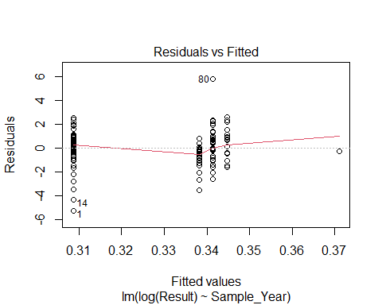

Trend Analysis for Selected Sums and Totals of Contaminants
================
Curtis C. Bohlen, Casco Bay Estuary Partnership
October 17, 2020

-   [Introduction](#introduction)
-   [Load Libraries](#load-libraries)
-   [Load Data](#load-data)
    -   [Folder References](#folder-references)
    -   [Load Sums Data](#load-sums-data)
        -   [Sums Data Caveates](#sums-data-caveates)
        -   [Change Factor Levels](#change-factor-levels)
        -   [Delete Unused Parameters](#delete-unused-parameters)
-   [Preliminary Trend Graphic](#preliminary-trend-graphic)
-   [Statistical Significance of Linear
    Trends](#statistical-significance-of-linear-trends)
-   [Ordered Factor Analysis by
    Decade](#ordered-factor-analysis-by-decade)


# Introduction

Casco Bay Estuary Partnership collected sediment samples in 1991, 1994,
2000, 2001, 2002, 2010, and 2011 to look at concentrations of toxic
contaminants in Casco Bay surface Sediments. These studies were
complemented by data collected by under the auspices of EPA’s the
National Coastal Assessment (NCA) and National Coastal Condition
Assessment (NCCA).

Chemicals studied included metals, polycyclic aromatic hydrocarbons
(PAHs), polychlorinated biphenyls (PCBs), organochlorine pesticides,
dioxins and furans, and organotins. These contaminants are all
persistent in the marine environment.

# Load Libraries

``` r
library(tidyverse)
#> -- Attaching packages --------------------------------------- tidyverse 1.3.0 --
#> v ggplot2 3.3.3     v purrr   0.3.4
#> v tibble  3.0.5     v dplyr   1.0.3
#> v tidyr   1.1.2     v stringr 1.4.0
#> v readr   1.4.0     v forcats 0.5.0
#> -- Conflicts ------------------------------------------ tidyverse_conflicts() --
#> x dplyr::filter() masks stats::filter()
#> x dplyr::lag()    masks stats::lag()
library(readxl)
library(knitr)

# library(GGally)

library(CBEPgraphics)
load_cbep_fonts()
theme_set(theme_cbep())

library(LCensMeans)
```

# Load Data

## Folder References

``` r
sibfldnm <- 'Derived_Data'
parent   <- dirname(getwd())
sibling  <- file.path(parent,sibfldnm)
niecefldnm <- 'Data_Subsets'
niece <- file.path(sibling,niecefldnm)
fn <- "sums_totals.csv"
```

## Load Sums Data

``` r
sums_data <- read_csv(file.path(niece,fn),
                      col_types = cols(.default = col_character(),
                                        Sample_Year = col_double(),
                                        Replicate = col_integer(),
                                        CASRN = col_skip(),
                                        Result = col_double(),
                                        MDL = col_skip(),
                                        RL = col_skip(),
                                        Det_Flag = col_skip(),
                                        Qualifier = col_skip(),
                                        `QA Qualifier` = col_skip(),
                                        Reportable_Result = col_skip(),
                                        ERL = col_double(),
                                        ERM = col_double() )
                      ) %>%
  mutate(Replicate = Replicate == -1)
```

### Sums Data Caveates

See the “Review\_Data.Rmd” and “Review\_Sums\_Data.Rmd” files for
details.

Sums are defined in Table 4 of the Ramboll report, available in the
“2017 Casco Bay Sediment Report Tables FINAL.xlsx” file in the
“Original\_Data” folder, and (implicitly) in the “SumGroups.xlsx” file
in the same folder.

**The metadata is not entirely clear, but it appears (from examining the
Access database) that these sums omit non-detects, effectively equating
non-detects to zero. That is inconsistent with how we handled
non-detects in several other toxics data sets, where we have been using
maximum likelihood estimators of expected values.**

Because of different analytic methods used in different years, sums
include a relatively small consistent subset of parameters, so they may
not be fully compatible with available benchmarks.

Many observations from 2010 and 2011 are zeros or NAs, because of high
detection limits. This is especially problem for data on Pesticides,
PCBs, and Butyltins in 2010 and 2011. Effectively, we have no data on
PCBs and Pesticides, and very little data on Butyltins from 2010 and
2011.

Ramboll Standardized units in the Access database, so, most sums are
expressed in ng/g dry weight (\~ ppb). The Dioxins and Furans are
expressed in ng/kg, or pg/g or approximately parts per trillion.

There are no SQuiRTs for Dioxins and Furans. Instead, Ramboll also
expressed them in TEQ – Tox equivalents. Toxic equivalents provide a way
to estimate the cumulative toxic effect of a mixture of related
chemicals by weighting each compound by its relative toxic effect,
compared to some reference compound (conventionally TCDD).

### Change Factor Levels

``` r
sums_data <- sums_data %>%

  mutate(Parameter = factor(Parameter,
                            levels = c(
                              "Butyltin (mono+di+tri)",
                              "CDD/CDF (total)",
                              "Chlordane (total)",
                              "DDT+DDE+DDD (sum)",
                              "PAHs (High MW)",
                              "PAHs (Low MW)",
                              "PAHs (total)",
                              "PCBs (total)",
                              "Pesticides (total)"),
                            labels = c("Butyltins",
                                       "Dioxins and Furans",
                                       "Chlordanes",
                                       "DDT Residues",
                                       "High MW PAHs",
                                       "Low MW PAHs",
                                       "Total PAHs",
                                       "Total PCBs",
                                       "Pesticides"))) %>%
  mutate(LVL = factor(LVL, levels = c('Below ERL','Between ERL and ERM',
                                     'Above ERM'))) %>%
  mutate(Region = factor(Region, levels = c("Inner Bay",
                                            "West Bay",
                                            "East Bay",
                                            "Outer Bay",
                                            "Cape Small")))
```

### Delete Unused Parameters

To simplify presentation for State of Casco Bay, we will not report all
totals. we remove unused data here.

``` r
sums_data <- sums_data %>%
  filter(! Parameter %in% c("Chlordanes", "High MW PAHs",
                            "Low MW PAHs", "Pesticides")) %>%
  mutate(Parameter = factor(Parameter,
                            levels = c("Butyltins",
                                       "Dioxins and Furans",
                                       "DDT Residues",
                                       "Total PAHs",
                                       "Total PCBs")))
```

# Preliminary Trend Graphic

``` r
sums_data %>%

  mutate(Parameter = factor(Parameter,
                            levels = c("Total PAHs", "Total PCBs",
                                       "DDT Residues", "Dioxins and Furans",
                                       "Butyltins"))) %>%
  mutate(Result = if_else(Parameter == "Dioxins and Furans",
                          Result/1000,
                          Result)) %>%
  
  ggplot(aes(x = Sample_Year, y = Result)) +
  geom_point(aes(color = LVL), size = 2, alpha = 0.5) +
  geom_smooth(method = 'lm', se = FALSE, color = cbep_colors()[3],
              lwd = 0.5, lty = 2) +
  
  scale_y_log10(labels=scales::comma) +
  scale_x_continuous(breaks = c(1990, 2000, 2010)) +
  scale_color_manual(name = '', values = cbep_colors(), na.value = "firebrick",
                     labels = c('Below ERL','Between ERL and ERM',
                                     'Above ERM', "No Reference Defined")) +
  
  facet_wrap(~Parameter, ncol = 5) +
  
  theme_cbep(base_size = 12) +

  ylab('Concentration (ppb)') +
  
  theme(axis.text.x = element_text(angle = 90, vjust = 0.25, hjust = 1)) +
  theme(legend.position = 'bottom',
        panel.border = element_rect(fill = NA, size = 0.25))
#> `geom_smooth()` using formula 'y ~ x'
#> Warning: Removed 230 rows containing non-finite values (stat_smooth).
#> Warning: Removed 230 rows containing missing values (geom_point).
```


# Statistical Significance of Linear Trends

``` r
mods <-sums_data %>%
  group_by(Parameter) %>%
  nest() %>%
  mutate(mod = lapply(data,
                      function(df) lm(log(Result) ~ Sample_Year, data = df)))
```

``` r
mods$Parameter
#> [1] Dioxins and Furans Butyltins          Total PAHs         Total PCBs        
#> [5] DDT Residues      
#> Levels: Butyltins Dioxins and Furans DDT Residues Total PAHs Total PCBs
lapply(mods$mod,summary)
#> [[1]]
#> 
#> Call:
#> lm(formula = log(Result) ~ Sample_Year, data = df)
#> 
#> Residuals:
#>      Min       1Q   Median       3Q      Max 
#> -2.29539 -0.63234 -0.08135  0.68522  1.72149 
#> 
#> Coefficients:
#>              Estimate Std. Error t value Pr(>|t|)    
#> (Intercept) 295.61742   33.92632   8.714 4.28e-13 ***
#> Sample_Year  -0.14446    0.01696  -8.518 1.02e-12 ***
#> ---
#> Signif. codes:  0 '***' 0.001 '**' 0.01 '*' 0.05 '.' 0.1 ' ' 1
#> 
#> Residual standard error: 0.9031 on 77 degrees of freedom
#> Multiple R-squared:  0.4851, Adjusted R-squared:  0.4785 
#> F-statistic: 72.56 on 1 and 77 DF,  p-value: 1.02e-12
#> 
#> 
#> [[2]]
#> 
#> Call:
#> lm(formula = log(Result) ~ Sample_Year, data = df)
#> 
#> Residuals:
#>      Min       1Q   Median       3Q      Max 
#> -1.76041 -0.55510  0.06896  0.46723  1.85527 
#> 
#> Coefficients:
#>              Estimate Std. Error t value Pr(>|t|)    
#> (Intercept) 187.05883   39.23357   4.768 1.45e-05 ***
#> Sample_Year  -0.09232    0.01963  -4.702 1.82e-05 ***
#> ---
#> Signif. codes:  0 '***' 0.001 '**' 0.01 '*' 0.05 '.' 0.1 ' ' 1
#> 
#> Residual standard error: 0.814 on 54 degrees of freedom
#>   (67 observations deleted due to missingness)
#> Multiple R-squared:  0.2905, Adjusted R-squared:  0.2774 
#> F-statistic: 22.11 on 1 and 54 DF,  p-value: 1.821e-05
#> 
#> 
#> [[3]]
#> 
#> Call:
#> lm(formula = log(Result) ~ Sample_Year, data = df)
#> 
#> Residuals:
#>     Min      1Q  Median      3Q     Max 
#> -4.5159 -0.6958  0.0281  0.7771  3.4244 
#> 
#> Coefficients:
#>              Estimate Std. Error t value Pr(>|t|)    
#> (Intercept) 221.22353   21.85915  10.120   <2e-16 ***
#> Sample_Year  -0.10778    0.01092  -9.869   <2e-16 ***
#> ---
#> Signif. codes:  0 '***' 0.001 '**' 0.01 '*' 0.05 '.' 0.1 ' ' 1
#> 
#> Residual standard error: 1.289 on 223 degrees of freedom
#> Multiple R-squared:  0.304,  Adjusted R-squared:  0.3009 
#> F-statistic: 97.39 on 1 and 223 DF,  p-value: < 2.2e-16
#> 
#> 
#> [[4]]
#> 
#> Call:
#> lm(formula = log(Result) ~ Sample_Year, data = df)
#> 
#> Residuals:
#>     Min      1Q  Median      3Q     Max 
#> -3.3691 -0.6213  0.0532  0.6440  3.7492 
#> 
#> Coefficients:
#>              Estimate Std. Error t value Pr(>|t|)    
#> (Intercept) 227.28909   38.76718   5.863 3.12e-08 ***
#> Sample_Year  -0.11294    0.01942  -5.816 3.91e-08 ***
#> ---
#> Signif. codes:  0 '***' 0.001 '**' 0.01 '*' 0.05 '.' 0.1 ' ' 1
#> 
#> Residual standard error: 1.176 on 140 degrees of freedom
#>   (81 observations deleted due to missingness)
#> Multiple R-squared:  0.1946, Adjusted R-squared:  0.1889 
#> F-statistic: 33.83 on 1 and 140 DF,  p-value: 3.907e-08
#> 
#> 
#> [[5]]
#> 
#> Call:
#> lm(formula = log(Result) ~ Sample_Year, data = df)
#> 
#> Residuals:
#>     Min      1Q  Median      3Q     Max 
#> -5.2649 -0.6792  0.0402  0.7430  5.7799 
#> 
#> Coefficients:
#>              Estimate Std. Error t value Pr(>|t|)
#> (Intercept) -6.235372  46.601998  -0.134    0.894
#> Sample_Year  0.003287   0.023343   0.141    0.888
#> 
#> Residual standard error: 1.411 on 139 degrees of freedom
#>   (82 observations deleted due to missingness)
#> Multiple R-squared:  0.0001426,  Adjusted R-squared:  -0.007051 
#> F-statistic: 0.01983 on 1 and 139 DF,  p-value: 0.8882
```

SO, all are highly statistically significant, except the DDT residues
total.

``` r
cat(paste(as.character(mods$Parameter), collapse = '   ...   '))
#> Dioxins and Furans   ...   Butyltins   ...   Total PAHs   ...   Total PCBs   ...   DDT Residues
cat('\n')
lapply(mods$mod,plot)
```



    #> [[1]]
    #> NULL
    #> 
    #> [[2]]
    #> NULL
    #> 
    #> [[3]]
    #> NULL
    #> 
    #> [[4]]
    #> NULL
    #> 
    #> [[5]]
    #> NULL

The model diagnostic plots are not great poor, for several of these
models, but not dreadful. Given high levels of statistical significance,
the model violations are probably not material, but a more careful
analysis might explore larger model spaces or use bootstraps or
permutation tests.

# Ordered Factor Analysis by Decade

We can also simplify tthe model to examine a linear trend by decade, but
results are generally similar.

``` r
mods2 <-sums_data %>%
  mutate(Era = ordered(Era, levels = c("1990s", "2000s", "2010s"))) %>%
  group_by(Parameter) %>%
  nest() %>%
  mutate(mod = lapply(data,
                      function(df) lm(log(Result) ~ Era, data = df)))
```

``` r
mods2$Parameter
#> [1] Dioxins and Furans Butyltins          Total PAHs         Total PCBs        
#> [5] DDT Residues      
#> Levels: Butyltins Dioxins and Furans DDT Residues Total PAHs Total PCBs
lapply(mods2$mod,summary)
#> [[1]]
#> 
#> Call:
#> lm(formula = log(Result) ~ Era, data = df)
#> 
#> Residuals:
#>     Min      1Q  Median      3Q     Max 
#> -1.8262 -0.3575  0.1594  0.4370  2.2873 
#> 
#> Coefficients:
#>             Estimate Std. Error t value Pr(>|t|)    
#> (Intercept)  6.33825    0.08302  76.348  < 2e-16 ***
#> Era.L       -1.77684    0.15218 -11.676  < 2e-16 ***
#> Era.Q       -1.01458    0.13488  -7.522 8.99e-11 ***
#> ---
#> Signif. codes:  0 '***' 0.001 '**' 0.01 '*' 0.05 '.' 0.1 ' ' 1
#> 
#> Residual standard error: 0.709 on 76 degrees of freedom
#> Multiple R-squared:  0.6868, Adjusted R-squared:  0.6786 
#> F-statistic: 83.33 on 2 and 76 DF,  p-value: < 2.2e-16
#> 
#> 
#> [[2]]
#> 
#> Call:
#> lm(formula = log(Result) ~ Era, data = df)
#> 
#> Residuals:
#>      Min       1Q   Median       3Q      Max 
#> -1.70713 -0.53474  0.03426  0.51468  1.75237 
#> 
#> Coefficients:
#>             Estimate Std. Error t value Pr(>|t|)    
#> (Intercept)   2.1800     0.1351  16.135  < 2e-16 ***
#> Era.L        -1.2312     0.2549  -4.831  1.2e-05 ***
#> Era.Q        -0.3059     0.2111  -1.449    0.153    
#> ---
#> Signif. codes:  0 '***' 0.001 '**' 0.01 '*' 0.05 '.' 0.1 ' ' 1
#> 
#> Residual standard error: 0.8081 on 53 degrees of freedom
#>   (67 observations deleted due to missingness)
#> Multiple R-squared:  0.3136, Adjusted R-squared:  0.2877 
#> F-statistic: 12.11 on 2 and 53 DF,  p-value: 4.674e-05
#> 
#> 
#> [[3]]
#> 
#> Call:
#> lm(formula = log(Result) ~ Era, data = df)
#> 
#> Residuals:
#>     Min      1Q  Median      3Q     Max 
#> -4.1171 -0.4939  0.0423  0.6595  3.1553 
#> 
#> Coefficients:
#>             Estimate Std. Error t value Pr(>|t|)    
#> (Intercept)  5.56336    0.07882  70.584  < 2e-16 ***
#> Era.L       -1.45419    0.13815 -10.526  < 2e-16 ***
#> Era.Q       -0.86903    0.13487  -6.443 7.16e-10 ***
#> ---
#> Signif. codes:  0 '***' 0.001 '**' 0.01 '*' 0.05 '.' 0.1 ' ' 1
#> 
#> Residual standard error: 1.176 on 222 degrees of freedom
#> Multiple R-squared:  0.4224, Adjusted R-squared:  0.4172 
#> F-statistic: 81.18 on 2 and 222 DF,  p-value: < 2.2e-16
#> 
#> 
#> [[4]]
#> 
#> Call:
#> lm(formula = log(Result) ~ Era, data = df)
#> 
#> Residuals:
#>     Min      1Q  Median      3Q     Max 
#> -3.4413 -0.6128  0.0992  0.6484  3.4783 
#> 
#> Coefficients:
#>             Estimate Std. Error t value Pr(>|t|)    
#> (Intercept)   2.5687     0.3804   6.753 3.63e-10 ***
#> Era.L         1.0826     0.8017   1.350 0.179072    
#> Era.Q         1.6885     0.4747   3.557 0.000514 ***
#> ---
#> Signif. codes:  0 '***' 0.001 '**' 0.01 '*' 0.05 '.' 0.1 ' ' 1
#> 
#> Residual standard error: 1.125 on 139 degrees of freedom
#>   (81 observations deleted due to missingness)
#> Multiple R-squared:  0.2679, Adjusted R-squared:  0.2573 
#> F-statistic: 25.43 on 2 and 139 DF,  p-value: 3.883e-10
#> 
#> 
#> [[5]]
#> 
#> Call:
#> lm(formula = log(Result) ~ Era, data = df)
#> 
#> Residuals:
#>     Min      1Q  Median      3Q     Max 
#> -5.2993 -0.6701  0.0221  0.7633  5.8063 
#> 
#> Coefficients:
#>             Estimate Std. Error t value Pr(>|t|)
#> (Intercept)  0.25114    0.47875   0.525    0.601
#> Era.L       -0.17512    1.00898  -0.174    0.862
#> Era.Q       -0.07839    0.59764  -0.131    0.896
#> 
#> Residual standard error: 1.416 on 138 degrees of freedom
#>   (82 observations deleted due to missingness)
#> Multiple R-squared:  0.0002917,  Adjusted R-squared:  -0.0142 
#> F-statistic: 0.02014 on 2 and 138 DF,  p-value: 0.9801
```

So, results are broadly similar. Note that PAHs show a significant
quadratic, but not linear trend. Unfortunately, if anything, the
diagnostic plots are worse, not better.

``` r
mods2$Parameter
#> [1] Dioxins and Furans Butyltins          Total PAHs         Total PCBs        
#> [5] DDT Residues      
#> Levels: Butyltins Dioxins and Furans DDT Residues Total PAHs Total PCBs
lapply(mods2$mod,plot)
```


    #> Warning: not plotting observations with leverage one:
    #>   142


    #> Warning: not plotting observations with leverage one:
    #>   141


    #> [[1]]
    #> NULL
    #> 
    #> [[2]]
    #> NULL
    #> 
    #> [[3]]
    #> NULL
    #> 
    #> [[4]]
    #> NULL
    #> 
    #> [[5]]
    #> NULL
