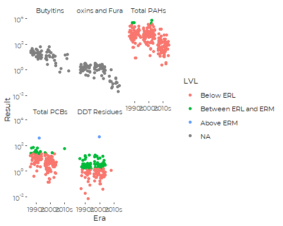
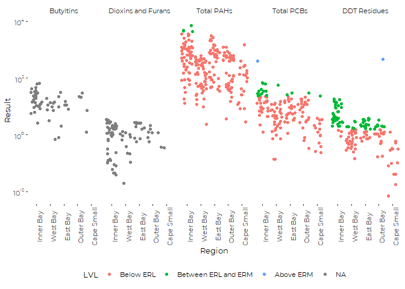
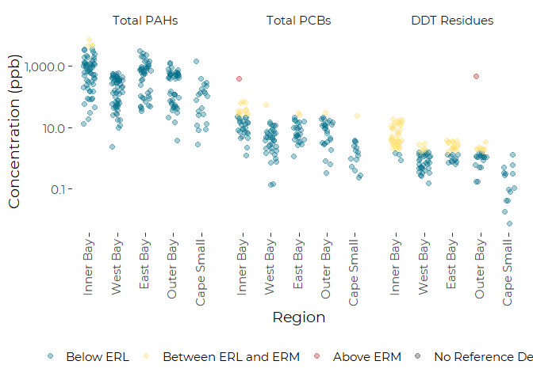
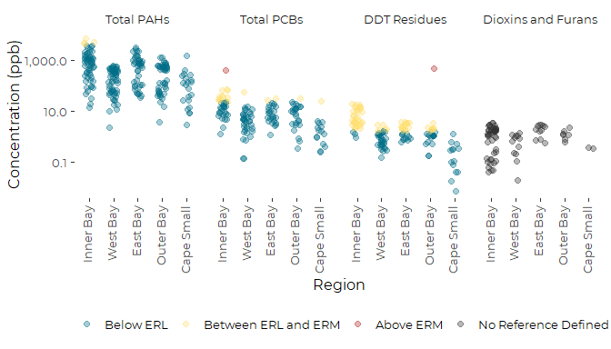
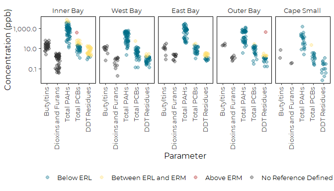
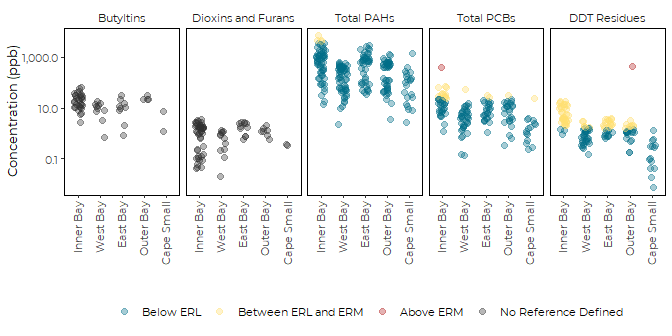
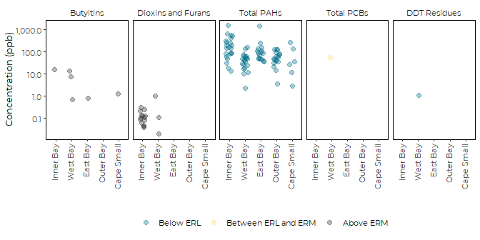
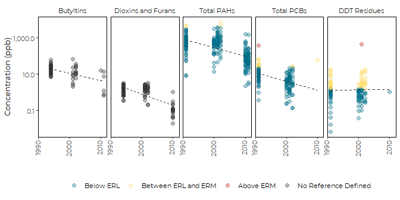
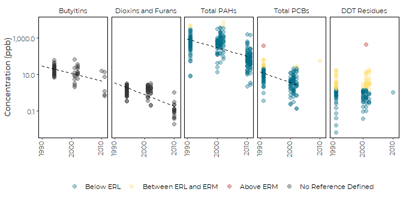

Graphics Based on Selected Sums and Totals of Contaminants
================
Curtis C. Bohlen, Casco Bay Estuary Partnership
Revised October 19, 2020

-   [Introduction](#introduction)
-   [Load Libraries](#load-libraries)
-   [Load Data](#load-data)
    -   [Folder References](#folder-references)
    -   [Sums Data](#sums-data)
        -   [Sums Data Caveates](#sums-data-caveates)
        -   [Change Factor Levels](#change-factor-levels)
        -   [Delete Unused Parameters](#delete-unused-parameters)
        -   [Reexpress Dioxins and Furans in
            PPB](#reexpress-dioxins-and-furans-in-ppb)
-   [Define Color Scale](#define-color-scale)
-   [Preliminary Graphics](#preliminary-graphics)
-   [Regional Graphics](#regional-graphics)
-   [Trend Graphics](#trend-graphics)
    -   [Add Only Selected Trendlines](#add-only-selected-trendlines)
    -   [Calculate Regression Line
        Points](#calculate-regression-line-points)


# Introduction

Casco Bay Estuary Partnership collected sediment samples in 1991, 1994,
2000, 2001, 2002, 2010, and 2011 to look at concentrations of toxic
contaminants in Casco Bay surface Sediments. These studies were
complemented by data collected by under the auspices of EPA’s the
National Coastal Assessment (NCA) and National Coastal Condition
Assessment (NCCA).

Chemicals studied included metals, polycyclic aromatic hydrocarbons
(PAHs), polychlorinated biphenyls (PCBs), organochlorine pesticides,
dioxins and furans, and organotins. These contaminants are all
persistent in the marine environment.

# Load Libraries

``` r
library(tidyverse)
#> Warning: package 'tidyverse' was built under R version 4.0.5
#> -- Attaching packages --------------------------------------- tidyverse 1.3.1 --
#> v ggplot2 3.3.5     v purrr   0.3.4
#> v tibble  3.1.6     v dplyr   1.0.7
#> v tidyr   1.1.4     v stringr 1.4.0
#> v readr   2.1.0     v forcats 0.5.1
#> Warning: package 'ggplot2' was built under R version 4.0.5
#> Warning: package 'tidyr' was built under R version 4.0.5
#> Warning: package 'dplyr' was built under R version 4.0.5
#> Warning: package 'forcats' was built under R version 4.0.5
#> -- Conflicts ------------------------------------------ tidyverse_conflicts() --
#> x dplyr::filter() masks stats::filter()
#> x dplyr::lag()    masks stats::lag()
library(readxl)
library(knitr)
#> Warning: package 'knitr' was built under R version 4.0.5

# library(GGally)

library(CBEPgraphics)
load_cbep_fonts()
theme_set(theme_cbep())

library(LCensMeans)
```

# Load Data

## Folder References

``` r
sibfldnm <- 'Derived_Data'
parent   <- dirname(getwd())
sibling  <- file.path(parent,sibfldnm)
niecefldnm <- 'Data_Subsets'
niece <- file.path(sibling,niecefldnm)
fn <- "sums_totals.csv"

dir.create(file.path(getwd(), 'figures'), showWarnings = FALSE)
```

## Sums Data

``` r
sums_data <- read_csv(file.path(niece,fn),
                      col_types = cols(.default = col_character(),
                                        Sample_Year = col_double(),
                                        Replicate = col_integer(),
                                        CASRN = col_skip(),
                                        Result = col_double(),
                                        MDL = col_skip(),
                                        RL = col_skip(),
                                        Det_Flag = col_skip(),
                                        Qualifier = col_skip(),
                                        `QA Qualifier` = col_skip(),
                                        Reportable_Result = col_skip(),
                                        ERL = col_double(),
                                        ERM = col_double() )
                      ) %>%
  mutate(Replicate = Replicate == -1)
```

### Sums Data Caveates

See the “Review\_Data.Rmd” and “Review\_Sums\_Data.Rmd” files for
details.

Sums are defined in Table 4 of the Ramboll report, available in the
“2017 Casco Bay Sediment Report Tables FINAL.xlsx” file in the
“Original\_Data” folder, and (implicitly) in the “SumGroups.xlsx” file
in the same folder.

**The metadata is not entirely clear, but it appears (from examining the
Access database) that these sums omit non-detects, effectively equating
non-detects to zero. That is inconsistent with how we handled
non-detects in several other toxics data sets, where we have been using
maximum likelihood estimators of expected values.**

Because of different analytic methods used in different years, sums
include a relatively small consistent subset of parameters, so they may
not be fully compatible with available benchmarks.

Many observations from 2010 and 2011 are zeros or NAs, because of high
detection limits. This is especially problem for data on Pesticides,
PCBs, and Butyltins in 2010 and 2011. Effectively, we have no data on
PCBs and Pesticides, and very little data on Butyltins from 2010 and
2011.

Ramboll standardized units in the Access database, so, most sums are
expressed in ng/g dry weight (\~ ppb). The Dioxins and Furans are
expressed in ng/kg, or pg/g or approximately parts per trillion. To
simplify graphics, we re-express the Dioxin and Furan values in PPB,
below.

There are no SQuiRTs for Dioxins and Furans. Instead, Ramboll also
expressed them in TEQ – toxic equivalents. Toxic equivalents provide a
way to estimate the cumulative toxic effect of a mixture of related
chemicals by weighting each compound by its relative toxic effect,
compared to some reference compound (conventionally TCDD).

### Change Factor Levels

``` r
sums_data <- sums_data %>%

  mutate(Parameter = factor(Parameter,
                            levels = c(
                              "Butyltin (mono+di+tri)",
                              "CDD/CDF (total)",
                              "Chlordane (total)",
                              "DDT+DDE+DDD (sum)",
                              "PAHs (High MW)",
                              "PAHs (Low MW)",
                              "PAHs (total)",
                              "PCBs (total)",
                              "Pesticides (total)"),
                            labels = c("Butyltins",
                                       "Dioxins and Furans",
                                       "Chlordanes",
                                       "DDT Residues",
                                       "High MW PAHs",
                                       "Low MW PAHs",
                                       "Total PAHs",
                                       "Total PCBs",
                                       "Pesticides"))) %>%
  mutate(LVL = factor(LVL, levels = c('Below ERL','Between ERL and ERM',
                                     'Above ERM'))) %>%
  mutate(Region = factor(Region, levels = c("Inner Bay",
                                            "West Bay",
                                            "East Bay",
                                            "Outer Bay",
                                            "Cape Small")))
```

### Delete Unused Parameters

To simplify presentation for State of Casco Bay, we will not report all
totals. we remove unused data here.

``` r
sums_data <- sums_data %>%
  filter(! Parameter %in% c("Chlordanes", "High MW PAHs",
                            "Low MW PAHs", "Pesticides")) %>%
  mutate(Parameter = factor(Parameter,
                            levels = c("Butyltins",
                                       "Dioxins and Furans",
                                       "Total PAHs",
                                       "Total PCBs",
                                       "DDT Residues"
                                       )))
```

### Reexpress Dioxins and Furans in PPB

``` r
sums_data <- sums_data %>%
  mutate(Result = if_else(Parameter == "Dioxins and Furans",
                          Result/1000,
                          Result))
```

# Define Color Scale

One reviewer pointed to possible confusion because of use of red as a
color for NA values, with a gray as one of our scale colors. That came
from use of our `cbep_colors()` color function. They suggested reversing
those color choices. Another alternative would be to use a portion of
our `cbep_colors2()` function’s sequential color range. But the latter
choice is complicated, as the sequential colors are sometimes fairly
similar, despite being spread out on a luminance scale.

We follow the reviewer’s suggestion, and create a color scale for these
graphics.

``` r
# First line is not necessary, but we like to keep color formats consistent....
fb <- rgb(t(col2rgb('firebrick')), maxColorValue = 255)
tox_colors <- c(cbep_colors()[1:2], fb)
na_color <- cbep_colors()[3]
rm(fb)
```

# Preliminary Graphics

``` r
sums_data %>%
  ggplot(aes(x = Era, y = Result, color = LVL)) +
  geom_jitter() +
  facet_wrap(~Parameter) +
  theme_cbep(base_size = 10) +
  scale_y_log10(breaks = scales::trans_breaks("log10", function(x) 100^x),
              labels = scales::trans_format("log10", scales::math_format(10^.x)))
#> Warning: Removed 230 rows containing missing values (geom_point).
```



``` r
sums_data %>%
  ggplot(aes(x = Region, y = Result, color = LVL)) +
  geom_jitter() +
  facet_wrap(~Parameter, ncol = 5, ) +
  theme_cbep(base_size = 10) +
  scale_y_log10(breaks = scales::trans_breaks("log10", function(x) 100^x),
              labels = scales::trans_format("log10", scales::math_format(10^.x))) +
  theme(axis.text.x = element_text(angle = 90)) +
  theme(legend.position = 'bottom')
#> Warning: Removed 230 rows containing missing values (geom_point).
```



# Regional Graphics

To make graphics comparable to the ones produced for the Portland Harbor
Toxics, we should focus on “Total PAHs”, “Total PCBs”, and “DDT
Residues”. It’s not obvious whether we should prepare panels by region
or by parameter, so we try both.

``` r
sums_data %>%
  filter(Parameter %in%
           c("Total PAHs", "Total PCBs", "DDT Residues")) %>%
  mutate(Parameter = factor(Parameter,
                            levels = c("Total PAHs", "Total PCBs",
                                       "DDT Residues"))) %>%

  ggplot(aes(x = Region, y = Result)) +
  geom_jitter(aes(color = LVL), size = 2, alpha = 0.35,
              width = 0.2, height = 0) +
  
  scale_y_log10(labels=scales::label_comma(accuracy = 0.1)) +
  scale_color_manual(name = '', values = tox_colors, na.value = na_color,
                     labels = c('Below ERL','Between ERL and ERM',
                                     'Above ERM', "No Reference Defined")) +
  
  facet_wrap(~Parameter) +
  
  theme_cbep(base_size = 14) +

  ylab('Concentration (ppb)') +
  
  theme(axis.text.x = element_text(angle = 90, vjust = 0.25, hjust = 1)) +
  theme(legend.position = 'bottom')
#> Warning: Removed 163 rows containing missing values (geom_point).
```



``` r
  
#ggsave('figures/threeorganics.pdf', device = cairo_pdf, width = 7, height = 5)
```

That DDT outlier deserves investigation. It is from a 2001 sample from
the National Coastal Condition Assessment (NCCA). We checked in the
on-line data for the NCCA, and confirmed that the value shown here is
correct, despite being substantially higher than other DDT data in the
“Outer Bay” Region. Investigating further, we find that this site is
close inshore near Cape Elizabeth, on the edge of Pond Cove. Portions of
Cape Elizabeth have a history of agricultural use, and it is not
unlikely that runoff from the region’s abandoned or active agricultural
lands might carry excess DDT residues compared to other Casco Bay
locations. We believe these data are correct, both regarding magnitude
and location.

``` r
sums_data %>%
  filter(Parameter %in%
           c("Total PAHs", "Total PCBs", "DDT Residues",
             "Dioxins and Furans")) %>%
  mutate(Parameter = factor(Parameter,
                            levels = c("Total PAHs", "Total PCBs",
                                       "DDT Residues",
                                       "Dioxins and Furans"))) %>%

  ggplot(aes(x = Region, y = Result)) +
  geom_jitter(aes(color = LVL), size = 2, alpha = 0.35, width = 0.2, height = 0) +
  
  scale_y_log10(labels=scales::label_comma(accuracy = 0.1)) +
  scale_color_manual(name = '', values = tox_colors, na.value = na_color,
                     labels = c('Below ERL','Between ERL and ERM',
                                     'Above ERM', "No Reference Defined")) +
  
  facet_wrap(~Parameter, ncol = 4) +
  
  theme_cbep(base_size = 12) +
  
  ylab('Concentration (ppb)') +
  
  theme(axis.text.x = element_text(angle = 90, vjust = 0.25, hjust = 1)) +
  theme(legend.position = 'bottom')
#> Warning: Removed 163 rows containing missing values (geom_point).
```



``` r
  
#ggsave('figures/fourorganics.pdf', device = cairo_pdf, width = 7, height = )
```

``` r
sums_data %>%
  ggplot(aes(x = Parameter, y = Result)) +
  geom_jitter(aes(color = LVL), size = 2, alpha = 0.35,
              width = 0.2, height = 0) +
  
  scale_y_log10(labels=scales::label_comma(accuracy = 0.1)) +
  scale_color_manual(name = '', values = tox_colors, na.value = na_color,
                     labels = c('Below ERL','Between ERL and ERM',
                                     'Above ERM', "No Reference Defined")) +
  
  facet_wrap(~Region, ncol = 5) +
  
  theme_cbep(base_size = 12) +

  ylab('Concentration (ppb)') +
  
  theme(axis.text.x = element_text(angle = 90, vjust = 0.25, hjust = 1)) +
  theme(legend.position = 'bottom',
        panel.border = element_rect(fill = NA, size = 0.25))
#> Warning: Removed 230 rows containing missing values (geom_point).
```



``` r
ggsave('figures/five_regions_by_Region.pdf', device = cairo_pdf,
       width = 7, height = 4)
#> Warning: Removed 230 rows containing missing values (geom_point).
```

``` r
sums_data %>%
  ggplot(aes(x = Region, y = Result)) +
  geom_jitter(aes(color = LVL), size = 2, alpha = 0.35, 
              width = 0.2, height = 0) +
  
  scale_y_log10(labels=scales::label_comma(accuracy = 0.1)) +
  scale_color_manual(name = '', values = tox_colors, na.value = na_color,
                     labels = c('Below ERL','Between ERL and ERM',
                                     'Above ERM', "No Reference Defined")) +
  
  facet_wrap(~Parameter, ncol = 5) +
  
  theme_cbep(base_size = 10) +

  ylab('Concentration (ppb)') +
  xlab('') +
  
  theme(axis.text.x = element_text(angle = 90, vjust = 0.35, hjust = 1)) +
  theme(legend.position = 'bottom',
        panel.border = element_rect(fill = NA, size = 0.25))
#> Warning: Removed 230 rows containing missing values (geom_point).
```



``` r
ggsave('figures/five_regions_by_parameter.pdf', device = cairo_pdf, width = 7, height = 3.5)
#> Warning: Removed 230 rows containing missing values (geom_point).
```

We don’t have sufficient detections to show a similar graphic for just
the 2010s. The Ramboll study treated non-detects as missing, thus
biasing estimation of sums, and failing to provide values to graph for
many observations from recent years, when non-detects were common. We
have chosen not to recalculate totals, to minimize changes from the
Ramboll report, but these graphics show why that may be problematic.

``` r
sums_data %>%
  filter(Sample_Year  > 2005) %>%
  ggplot(aes(x = Region, y = Result)) +
  geom_jitter(aes(color = LVL), size = 2, alpha = 0.35, 
              width = 0.2, height = 0) +
  
  scale_y_log10(labels=scales::label_comma(accuracy = 0.1)) +
  scale_color_manual(name = '', values = tox_colors, na.value = na_color,
                     labels = c('Below ERL','Between ERL and ERM',
                                     'Above ERM', "No Reference Defined")) +
  
  facet_wrap(~Parameter, ncol = 5) +
  
  theme_cbep(base_size = 10) +

  ylab('Concentration (ppb)') +
  xlab('') +
  
  theme(axis.text.x = element_text(angle = 90, vjust = 0.25, hjust = 1)) +
  theme(legend.position = 'bottom',
        panel.border = element_rect(fill = NA, size = 0.25))
#> Warning: Removed 215 rows containing missing values (geom_point).
```



``` r
#ggsave('figures/five_regions_by_parameter_recent.pdf', device = cairo_pdf, width = 7, height = 3.5)
```

# Trend Graphics

``` r
plt <- sums_data %>%
  ggplot(aes(x = Sample_Year, y = Result)) +
  geom_point(aes(color = LVL), size = 2, alpha = 0.35) +
 
  
  scale_y_log10(labels=scales::label_comma(accuracy = 0.1)) +
  scale_x_continuous(breaks = c(1990, 2000, 2010)) +
  scale_color_manual(name = '', values = tox_colors, na.value = na_color,
                     labels = c('Below ERL','Between ERL and ERM',
                                     'Above ERM', "No Reference Defined")) +
  
  facet_wrap(~Parameter, ncol = 5) +

  theme_cbep(base_size = 10) +

  ylab('Concentration (ppb)') +
  xlab('') +

  theme(axis.text.x = element_text(angle = 90, vjust = 0.25, hjust = 1)) +
  theme(legend.position = 'bottom',
        panel.border = element_rect(fill = NA, size = 0.25))

plt+
   geom_smooth(method = 'lm', se = FALSE, color = cbep_colors()[3],
              lwd = 0.5, lty = 2)
#> `geom_smooth()` using formula 'y ~ x'
#> Warning: Removed 230 rows containing non-finite values (stat_smooth).
#> Warning: Removed 230 rows containing missing values (geom_point).
```



## Add Only Selected Trendlines

We should NOT show trend lines for: \* DDT – trend not significant , and
few detects in 2010 \* PCBs – few detects in 2010, so stop regression
line in 2002.

Arguably, a trend line is potentially misleading for Dioxins and Furans
as well, since the “trend” all occurs between 2000 and 2010, but we’ll
leave that in as the graphic makes that clear.

We can build a data frame to control where lines are drawn as follows.
We run linear models, extract coefficients (or predictions), calculate
predictions, and plot.

## Calculate Regression Line Points

``` r
  slope_and_intercept <- sums_data %>%
  
  # Remove DDT data, for which we want no line
  filter(Parameter != "DDT Residues") %>%
  # Remove lone detection in 2010 for PCBs, so we fit shorter line
  filter(! (Parameter == "Total PCBs" & Sample_Year > 2005)) %>%
  # Calculate linear regressions
  group_by(Parameter) %>%
  nest() %>%
  mutate(mod = lapply(data,
                      function(df) lm(log(Result) ~ Sample_Year, data = df))) %>%
  # Split out coefficients
  mutate(intercept  = unlist(lapply(mod, function(X) coefficients(X)[1])),
         slope  = unlist(lapply(mod, function(X) coefficients(X)[2]))) %>%
  # Clean up
  select(-mod, - data) %>%
  unnest(c(slope, intercept)) %>%
  ungroup(Parameter)
```

``` r
predicts <- slope_and_intercept %>%
  # add upper and lower limits for regression lines
  mutate(lwr = 1990, upr = if_else(Parameter == "Total PCBs", 2002, 2011)) %>%
  # Pivot Longer
  pivot_longer(c(lwr,upr), names_to = "end", values_to = "Year") %>%
  mutate(predict = exp(intercept + slope * Year))
```

``` r
plt + geom_line(aes(Year, predict), data = predicts, lwd = 0.5, lty = 2)
#> Warning: Removed 230 rows containing missing values (geom_point).
```



``` r
ggsave('figures/five_organics_trends.pdf',
       device = cairo_pdf, width = 7, height = 3.5)
#> Warning: Removed 230 rows containing missing values (geom_point).
```
